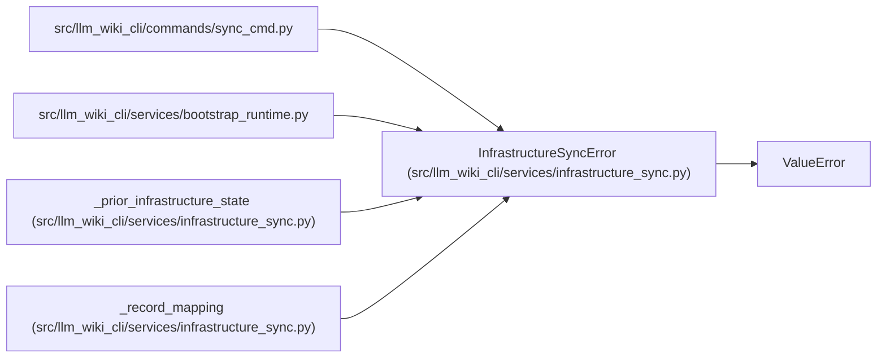

# InfrastructureSyncError

**Location:** `src/llm_wiki_cli/services/infrastructure_sync.py:33`
**Kind:** Class
**Bases:** `ValueError`
**Module:** [infrastructure_sync](../modules/infrastructure_sync.md)

## Description

Persisted infrastructure state is unsafe or internally inconsistent.

## Attributes

*No annotated attributes found.*

## Methods

*No public methods. Inherits from base classes.*

## Relationships

<!-- Auto-generated relationship summary. Do not edit by hand. -->

### Summary

| Module | Methods | Attributes |
|---|---:|---|
| [infrastructure_sync](../modules/infrastructure_sync.md) | 0 | — |

### Structure

| Kind | Entity | Module |
|---|---|---|
| Base | `ValueError` | — |

### References

| Reference | Kind | Source |
|---|---|---|
| `sync_cmd` | import | [sync_cmd](../modules/sync_cmd.md) |
| `bootstrap_runtime` | import | [bootstrap_runtime](../modules/bootstrap_runtime.md) |
| `_prior_infrastructure_state` | call | [infrastructure_sync](../modules/infrastructure_sync.md) |
| `_prior_infrastructure_state` | call | [infrastructure_sync](../modules/infrastructure_sync.md) |
| `_record_mapping` | call | [infrastructure_sync](../modules/infrastructure_sync.md) |
| `_record_mapping` | call | [infrastructure_sync](../modules/infrastructure_sync.md) |
| `_record_mapping` | call | [infrastructure_sync](../modules/infrastructure_sync.md) |
| `_record_mapping` | call | [infrastructure_sync](../modules/infrastructure_sync.md) |
| `_record_mapping` | call | [infrastructure_sync](../modules/infrastructure_sync.md) |
| `_record_mapping` | call | [infrastructure_sync](../modules/infrastructure_sync.md) |
| `_record_mapping` | call | [infrastructure_sync](../modules/infrastructure_sync.md) |
| `_record_mapping` | call | [infrastructure_sync](../modules/infrastructure_sync.md) |
