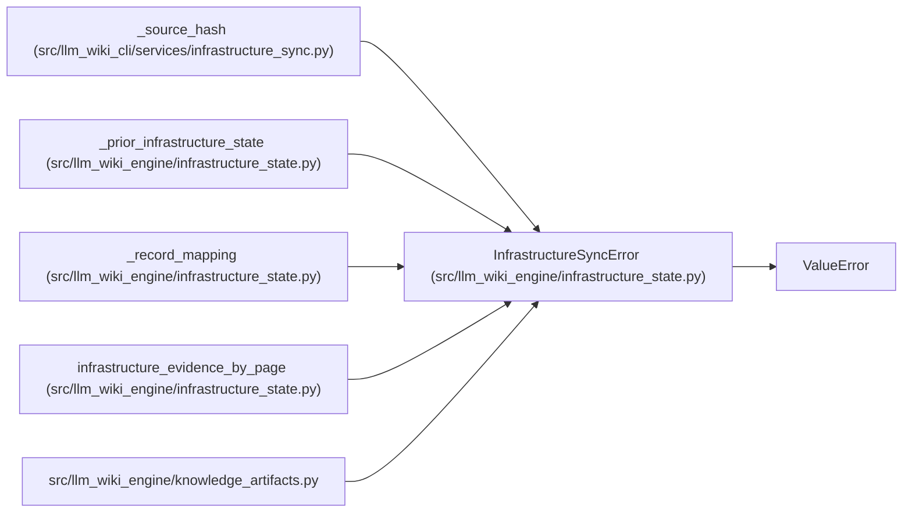

# InfrastructureSyncError

**Location:** `src/llm_wiki_engine/infrastructure_state.py:27`
**Kind:** Class
**Bases:** `ValueError`
**Module:** [infrastructure_state](../modules/infrastructure_state.md)

## Description

Persisted infrastructure state is unsafe or internally inconsistent.

## Attributes

*No annotated attributes found.*

## Methods

*No declared methods.*

## Relationships

<!-- Auto-generated relationship summary. Do not edit by hand. -->

```mermaid
flowchart LR
    n0["InfrastructureSyncError (src/llm_wiki_engine/infrastructure_state.py)"]
    n1["ValueError"]
    n2["_source_hash (src/llm_wiki_cli/services/infrastructure_sync.py)"]
    n3["_prior_infrastructure_state (src/llm_wiki_engine/infrastructure_state.py)"]
    n4["_record_mapping (src/llm_wiki_engine/infrastructure_state.py)"]
    n5["infrastructure_evidence_by_page (src/llm_wiki_engine/infrastructure_state.py)"]
    n6["src/llm_wiki_engine/knowledge_artifacts.py"]
    n0 --> n1
    n2 --> n0
    n3 --> n0
    n4 --> n0
    n5 --> n0
    n6 --> n0
    click n0 "../modules/infrastructure_state.md"
    click n2 "../modules/infrastructure_sync.md"
    click n3 "../modules/infrastructure_state.md"
    click n4 "../modules/infrastructure_state.md"
    click n5 "../modules/infrastructure_state.md"
    click n6 "../modules/knowledge_artifacts.md"
```

### Summary

| Module | Methods | Attributes |
|---|---:|---|
| [infrastructure_state](../modules/infrastructure_state.md) | 0 | — |

### Structure

| Kind | Entity | Module |
|---|---|---|
| Base | `ValueError` | — |

### References

| Reference | Kind | Source | Call sites |
|---|---|---|---:|
| `_source_hash` | call | [infrastructure_sync](../modules/infrastructure_sync.md) | 1 |
| `_prior_infrastructure_state` | call | [infrastructure_state](../modules/infrastructure_state.md) | 2 |
| `_record_mapping` | call | [infrastructure_state](../modules/infrastructure_state.md) | 14 |
| `infrastructure_evidence_by_page` | call | [infrastructure_state](../modules/infrastructure_state.md) | 1 |
| `knowledge_artifacts` | import | [knowledge_artifacts](../modules/knowledge_artifacts.md) | — |
