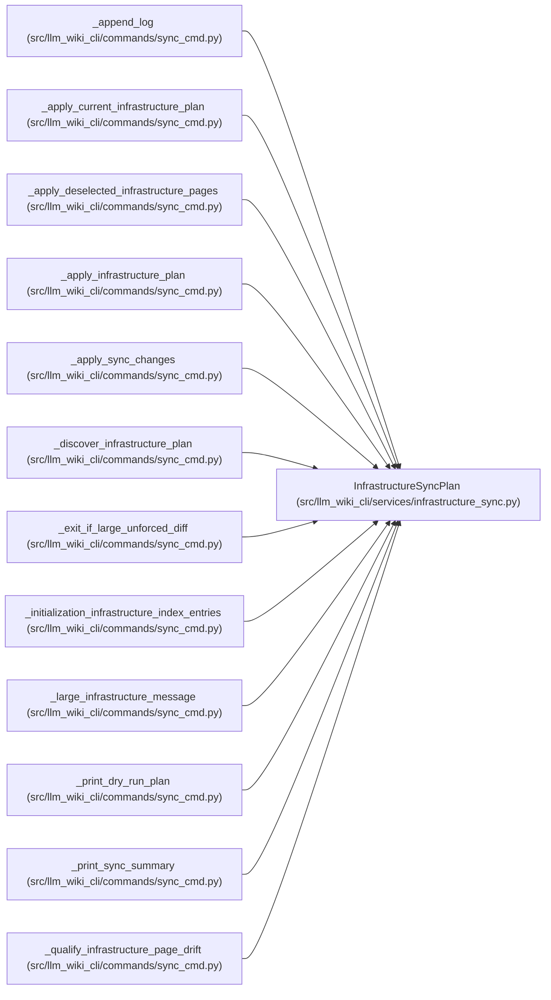

# InfrastructureSyncPlan

**Location:** `src/llm_wiki_cli/services/infrastructure_sync.py:543`
**Kind:** Class
**Bases:** —
**Module:** [infrastructure_sync](../modules/infrastructure_sync.md)

**Decorators:** `@dataclass(frozen=True)`

## Description

One immutable infrastructure regeneration plan.

## Attributes

| Name | Type | Default | Description |
|------|------|---------|-------------|
| `inventory` | `dict[str, dict]` | *required* | — |
| `prior_sources` | `dict[str, dict[str, object]]` | *required* | — |
| `current_sources` | `dict[str, dict[str, object]]` | *required* | — |
| `new_sources` | `tuple[str, ...]` | *required* | — |
| `changed_sources` | `tuple[str, ...]` | *required* | — |
| `unchanged_sources` | `tuple[str, ...]` | *required* | — |
| `removed_sources` | `tuple[str, ...]` | *required* | — |
| `moved_sources` | `dict[str, str]` | *required* | — |
| `unsupported_yaml` | `tuple[dict[str, object], ...]` | *required* | — |
| `discovery_roots` | `tuple[str, ...]` | *required* | — |
| `next_state` | `dict[str, object]` | *required* | — |
| `deselection_only_state` | `dict[str, object]` | *required* | — |
| `state_changed` | `bool` | *required* | — |
| `deselection_state_changed` | `bool` | *required* | — |
| `repair_tombstones` | `tuple[str, ...]` | `()` | — |
| `cleanup_moved_pages` | `tuple[str, ...]` | `()` | — |
| `deselected_records` | `dict[str, dict[str, object]]` | `field(default_factory=dict)` | — |

## Methods

| Method | Signature | Decorators | Description |
|--------|-----------|------------|-------------|
| `has_deselection_changes` | `() -> bool` | `@property` | Return whether policy narrowing changes persisted infrastructure state. |
| `deselected_page_paths` | `() -> tuple[str, ...]` | `@property` | Return pages owned only by records removed through policy narrowing. |
| `affected_count` | `() -> int` | `@property` | — |
| `has_changes` | `() -> bool` | `@property` | — |

## Relationships

<!-- Auto-generated relationship summary. Do not edit by hand. -->

### Summary

| Module | Methods | Attributes |
|---|---:|---|
| [infrastructure_sync](../modules/infrastructure_sync.md) | 4 | `changed_sources`, `cleanup_moved_pages`, `current_sources`, `deselected_records`, `deselection_only_state`, `deselection_state_changed`, `discovery_roots`, `inventory`, `moved_sources`, `new_sources`, `next_state`, `prior_sources` |

### References

| Reference | Kind | Source |
|---|---|---|
| `_append_log` | type_reference | [sync_cmd](../modules/sync_cmd.md) |
| `_apply_current_infrastructure_plan` | type_reference | [sync_cmd](../modules/sync_cmd.md) |
| `_apply_deselected_infrastructure_pages` | type_reference | [sync_cmd](../modules/sync_cmd.md) |
| `_apply_infrastructure_plan` | type_reference | [sync_cmd](../modules/sync_cmd.md) |
| `_apply_sync_changes` | type_reference | [sync_cmd](../modules/sync_cmd.md) |
| `_discover_infrastructure_plan` | type_reference | [sync_cmd](../modules/sync_cmd.md) |
| `_exit_if_large_unforced_diff` | type_reference | [sync_cmd](../modules/sync_cmd.md) |
| `_initialization_infrastructure_index_entries` | type_reference | [sync_cmd](../modules/sync_cmd.md) |
| `_large_infrastructure_message` | type_reference | [sync_cmd](../modules/sync_cmd.md) |
| `_print_dry_run_plan` | type_reference | [sync_cmd](../modules/sync_cmd.md) |
| `_print_sync_summary` | type_reference | [sync_cmd](../modules/sync_cmd.md) |
| `_qualify_infrastructure_page_drift` | type_reference | [sync_cmd](../modules/sync_cmd.md) |
