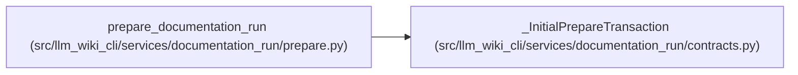

# _InitialPrepareTransaction

**Location:** `src/llm_wiki_cli/services/documentation_run/contracts.py:949`
**Kind:** Class
**Bases:** —
**Module:** [documentation_run_contracts](../modules/documentation_run_contracts.md)

**Decorators:** `@dataclass`

## Description

Tracks a pristine workspace root until initial preparation commits.

## Attributes

| Name | Type | Default | Description |
|------|------|---------|-------------|
| `workspace_root` | `Path \| None` | `None` | — |
| `root_identity` | `tuple[int, int, int] \| None` | `None` | — |
| `preserve_root` | `bool` | `False` | — |

## Methods

| Method | Signature | Decorators | Description |
|--------|-----------|------------|-------------|
| `active` | `() -> bool` | `@property` | — |
| `clear` | `() -> None` | — | — |

## Relationships

<!-- Auto-generated relationship summary. Do not edit by hand. -->

### Summary

| Module | Methods | Attributes |
|---|---:|---|
| [documentation_run_contracts](../modules/documentation_run_contracts.md) | 2 | `preserve_root`, `root_identity`, `workspace_root` |

### References

| Reference | Kind | Source |
|---|---|---|
| `prepare_documentation_run` | call | [prepare](../modules/prepare.md) |
