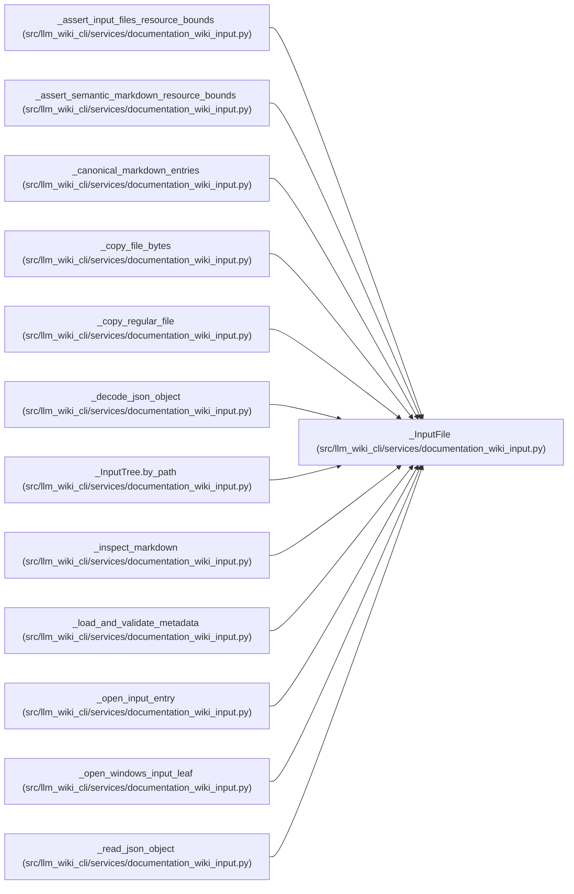

# _InputFile

**Location:** `src/llm_wiki_cli/services/documentation_wiki_input.py:351`
**Kind:** Class
**Bases:** —
**Module:** [documentation_wiki_input](../modules/documentation_wiki_input.md)

**Decorators:** `@dataclass(frozen=True)`

## Description

_Auto-generated from `_InputFile` in `src/llm_wiki_cli/services/documentation_wiki_input.py`._

## Attributes

| Name | Type | Default | Description |
|------|------|---------|-------------|
| `path` | `Path` | *required* | — |
| `relative_path` | `str` | *required* | — |
| `sha256` | `str` | *required* | — |
| `size` | `int` | *required* | — |
| `mtime_ns` | `int` | *required* | — |
| `ctime_ns` | `int` | *required* | — |
| `device` | `int` | *required* | — |
| `inode` | `int` | *required* | — |
| `root_descriptor` | `int \| None` | `None` | — |

## Methods

*No public methods. Inherits from base classes.*

## Relationships

<!-- Auto-generated relationship summary. Do not edit by hand. -->

### Summary

| Module | Methods | Attributes |
|---|---:|---|
| [documentation_wiki_input](../modules/documentation_wiki_input.md) | 0 | `ctime_ns`, `device`, `inode`, `mtime_ns`, `path`, `relative_path`, `root_descriptor`, `sha256`, `size` |

### References

| Reference | Kind | Source |
|---|---|---|
| `_assert_input_files_resource_bounds` | type_reference | [documentation_wiki_input](../modules/documentation_wiki_input.md) |
| `_assert_semantic_markdown_resource_bounds` | type_reference | [documentation_wiki_input](../modules/documentation_wiki_input.md) |
| `_canonical_markdown_entries` | type_reference | [documentation_wiki_input](../modules/documentation_wiki_input.md) |
| `_copy_file_bytes` | type_reference | [documentation_wiki_input](../modules/documentation_wiki_input.md) |
| `_copy_regular_file` | type_reference | [documentation_wiki_input](../modules/documentation_wiki_input.md) |
| `_decode_json_object` | type_reference | [documentation_wiki_input](../modules/documentation_wiki_input.md) |
| `_InputTree.by_path` | type_reference | [documentation_wiki_input](../modules/documentation_wiki_input.md) |
| `_inspect_markdown` | type_reference | [documentation_wiki_input](../modules/documentation_wiki_input.md) |
| `_load_and_validate_metadata` | type_reference | [documentation_wiki_input](../modules/documentation_wiki_input.md) |
| `_open_input_entry` | type_reference | [documentation_wiki_input](../modules/documentation_wiki_input.md) |
| `_open_windows_input_leaf` | type_reference | [documentation_wiki_input](../modules/documentation_wiki_input.md) |
| `_read_json_object` | type_reference | [documentation_wiki_input](../modules/documentation_wiki_input.md) |
