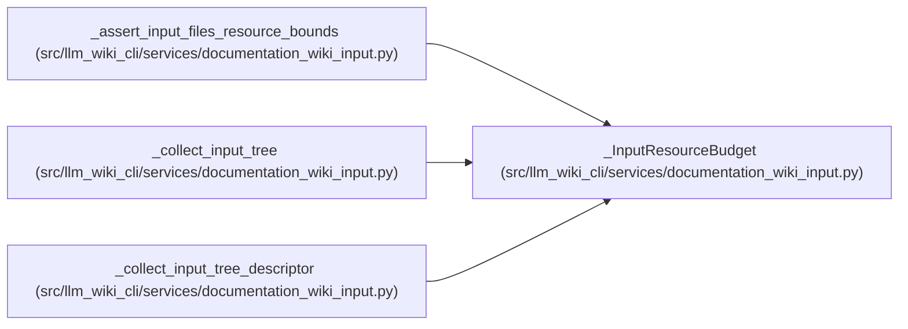

# _InputResourceBudget

**Location:** `src/llm_wiki_cli/services/documentation_wiki_input.py:447`
**Kind:** Class
**Bases:** —
**Module:** [documentation_wiki_input](../modules/documentation_wiki_input.md)

**Decorators:** `@dataclass`

## Description

_Auto-generated from `_InputResourceBudget` in `src/llm_wiki_cli/services/documentation_wiki_input.py`._

## Attributes

| Name | Type | Default | Description |
|------|------|---------|-------------|
| `entry_count` | `int` | `0` | — |
| `file_count` | `int` | `0` | — |
| `directory_count` | `int` | `0` | — |
| `total_bytes` | `int` | `0` | — |
| `maximum_depth` | `int` | `0` | — |

## Methods

| Method | Signature | Decorators | Description |
|--------|-----------|------------|-------------|
| `observe_entry` | `(relative: PurePosixPath) -> None` | — | — |
| `account_directory` | `() -> None` | — | — |
| `account_file` | `(relative_path: str, size: int) -> None` | — | — |

## Relationships

<!-- Auto-generated relationship summary. Do not edit by hand. -->

### Summary

| Module | Methods | Attributes |
|---|---:|---|
| [documentation_wiki_input](../modules/documentation_wiki_input.md) | 3 | `directory_count`, `entry_count`, `file_count`, `maximum_depth`, `total_bytes` |

### References

| Reference | Kind | Source | Call sites |
|---|---|---|---:|
| `_assert_input_files_resource_bounds` | call | [documentation_wiki_input](../modules/documentation_wiki_input.md) | 1 |
| `_collect_input_tree` | call | [documentation_wiki_input](../modules/documentation_wiki_input.md) | 1 |
| `_collect_input_tree_descriptor` | call | [documentation_wiki_input](../modules/documentation_wiki_input.md) | 1 |
