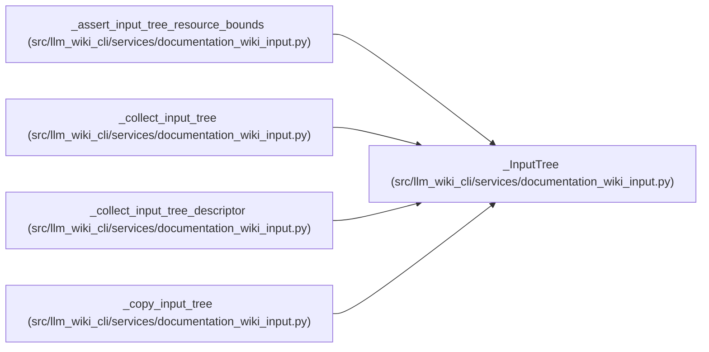

# _InputTree

**Location:** `src/llm_wiki_cli/services/documentation_wiki_input.py:370`
**Kind:** Class
**Bases:** —
**Module:** [documentation_wiki_input](../modules/documentation_wiki_input.md)

**Decorators:** `@dataclass(frozen=True)`

## Description

_Auto-generated from `_InputTree` in `src/llm_wiki_cli/services/documentation_wiki_input.py`._

## Attributes

| Name | Type | Default | Description |
|------|------|---------|-------------|
| `root` | `Path` | *required* | — |
| `files` | `tuple[_InputFile, ...]` | *required* | — |
| `tree_hash` | `str` | *required* | — |
| `entry_count` | `int` | *required* | — |
| `directory_count` | `int` | *required* | — |
| `maximum_depth` | `int` | *required* | — |

## Methods

| Method | Signature | Decorators | Description |
|--------|-----------|------------|-------------|
| `file_hashes` | `() -> dict[str, str]` | `@property` | — |
| `by_path` | `() -> dict[str, _InputFile]` | `@property` | — |
| `total_bytes` | `() -> int` | `@property` | — |
| `resource_usage` | `() -> dict[str, int]` | `@property` | — |

## Relationships

<!-- Auto-generated relationship summary. Do not edit by hand. -->

### Summary

| Module | Methods | Attributes |
|---|---:|---|
| [documentation_wiki_input](../modules/documentation_wiki_input.md) | 4 | `directory_count`, `entry_count`, `files`, `maximum_depth`, `root`, `tree_hash` |

### References

| Reference | Kind | Source | Call sites |
|---|---|---|---:|
| `_assert_input_tree_resource_bounds` | type_reference | [documentation_wiki_input](../modules/documentation_wiki_input.md) | — |
| `_collect_input_tree` | call | [documentation_wiki_input](../modules/documentation_wiki_input.md) | 1 |
| `_collect_input_tree` | type_reference | [documentation_wiki_input](../modules/documentation_wiki_input.md) | — |
| `_collect_input_tree_descriptor` | call | [documentation_wiki_input](../modules/documentation_wiki_input.md) | 1 |
| `_collect_input_tree_descriptor` | type_reference | [documentation_wiki_input](../modules/documentation_wiki_input.md) | — |
| `_copy_input_tree` | type_reference | [documentation_wiki_input](../modules/documentation_wiki_input.md) | — |
