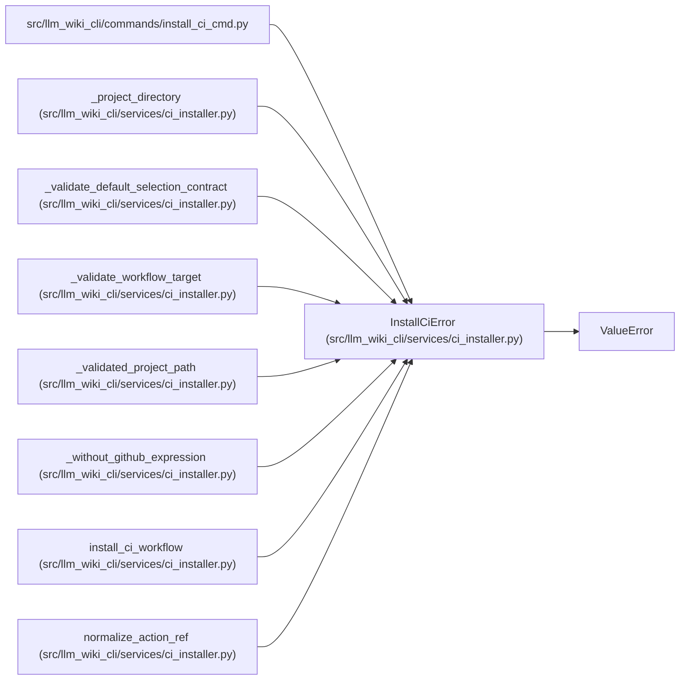

# InstallCiError

**Location:** `src/llm_wiki_cli/services/ci_installer.py:42`
**Kind:** Class
**Bases:** `ValueError`
**Module:** [ci_installer](../modules/ci_installer.md)

## Description

Raised when a portable CI workflow cannot be installed safely.

## Attributes

*No annotated attributes found.*

## Methods

*No public methods. Inherits from base classes.*

## Relationships

<!-- Auto-generated relationship summary. Do not edit by hand. -->

### Summary

| Module | Methods | Attributes |
|---|---:|---|
| [ci_installer](../modules/ci_installer.md) | 0 | — |

### Structure

| Kind | Entity | Module |
|---|---|---|
| Base | `ValueError` | — |

### References

| Reference | Kind | Source | Call sites |
|---|---|---|---:|
| `install_ci_cmd` | import | [install_ci_cmd](../modules/install_ci_cmd.md) | — |
| `_project_directory` | call | [ci_installer](../modules/ci_installer.md) | 5 |
| `_validate_default_selection_contract` | call | [ci_installer](../modules/ci_installer.md) | 2 |
| `_validate_workflow_target` | call | [ci_installer](../modules/ci_installer.md) | 3 |
| `_validated_project_path` | call | [ci_installer](../modules/ci_installer.md) | 7 |
| `_without_github_expression` | call | [ci_installer](../modules/ci_installer.md) | 1 |
| `install_ci_workflow` | call | [ci_installer](../modules/ci_installer.md) | 6 |
| `normalize_action_ref` | call | [ci_installer](../modules/ci_installer.md) | 1 |
