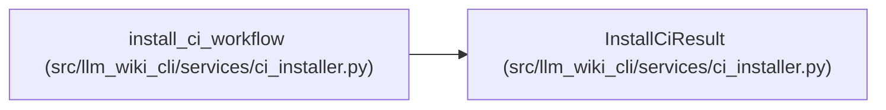

# InstallCiResult

**Location:** `src/llm_wiki_cli/services/ci_installer.py:47`
**Kind:** Class
**Bases:** —
**Module:** [ci_installer](../modules/ci_installer.md)

**Decorators:** `@dataclass(frozen=True)`

## Description

Outcome of one workflow installation attempt.

## Attributes

| Name | Type | Default | Description |
|------|------|---------|-------------|
| `path` | `Path` | *required* | — |
| `operation` | `str` | *required* | — |
| `action_ref` | `str` | *required* | — |
| `dry_run` | `bool` | *required* | — |

## Methods

| Method | Signature | Decorators | Description |
|--------|-----------|------------|-------------|
| `changed` | `() -> bool` | `@property` | — |

## Relationships

<!-- Auto-generated relationship summary. Do not edit by hand. -->

### Summary

| Module | Methods | Attributes |
|---|---:|---|
| [ci_installer](../modules/ci_installer.md) | 1 | `action_ref`, `dry_run`, `operation`, `path` |

### References

| Reference | Kind | Source | Call sites |
|---|---|---|---:|
| `install_ci_workflow` | call | [ci_installer](../modules/ci_installer.md) | 2 |
| `install_ci_workflow` | type_reference | [ci_installer](../modules/ci_installer.md) | — |
