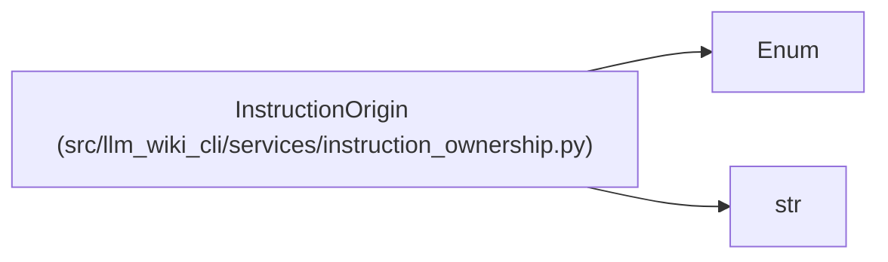

# InstructionOrigin

**Location:** `src/llm_wiki_cli/services/instruction_ownership.py:48`
**Kind:** Enum
**Bases:** `str`, `Enum`
**Module:** [instruction_ownership](../modules/instruction_ownership.md)

## Description

Renderer fragment that currently carries a correctness rule.

## Attributes

| Name | Declared value | Description |
|------|-------|-------------|
| `GENERATED_BODY` | `'generated_body'` | — |
| `SYNC_INSTRUCTIONS` | `'sync_instructions'` | — |

## Methods

*No public methods. Inherits from base classes.*

## Relationships

<!-- Auto-generated relationship summary. Do not edit by hand. -->

### Summary

| Module | Methods | Attributes |
|---|---:|---|
| [instruction_ownership](../modules/instruction_ownership.md) | 0 | `GENERATED_BODY`, `SYNC_INSTRUCTIONS` |

### Structure

| Kind | Entity | Module |
|---|---|---|
| Base | `Enum` | — |
| Base | `str` | — |
