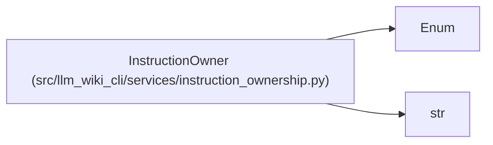

# InstructionOwner

**Location:** `src/llm_wiki_cli/services/instruction_ownership.py:29`
**Kind:** Enum
**Bases:** `str`, `Enum`
**Module:** [instruction_ownership](../modules/instruction_ownership.md)

## Description

Canonical owner classes for generated instruction content.

## Attributes

| Name | Declared value | Description |
|------|-------|-------------|
| `KERNEL` | `'kernel'` | — |
| `KNOWLEDGE_CONSUMER` | `'knowledge_consumer'` | — |
| `MANAGED_REFERENCE_TOPIC` | `'managed_reference_topic'` | — |
| `WORKFLOW_SKILL` | `'workflow_skill'` | — |
| `DETERMINISTIC_CLI_LINT` | `'deterministic_cli_lint'` | — |
| `REMOVED_DUPLICATE` | `'removed_duplicate'` | — |

## Methods

*No public methods. Inherits from base classes.*

## Relationships

<!-- Auto-generated relationship summary. Do not edit by hand. -->

### Summary

| Module | Methods | Attributes |
|---|---:|---|
| [instruction_ownership](../modules/instruction_ownership.md) | 0 | `DETERMINISTIC_CLI_LINT`, `KERNEL`, `KNOWLEDGE_CONSUMER`, `MANAGED_REFERENCE_TOPIC`, `REMOVED_DUPLICATE`, `WORKFLOW_SKILL` |

### Structure

| Kind | Entity | Module |
|---|---|---|
| Base | `Enum` | — |
| Base | `str` | — |
