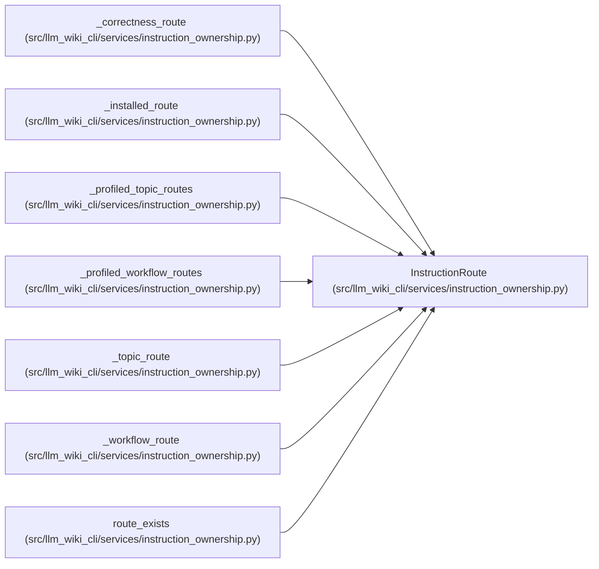

# InstructionRoute

**Location:** `src/llm_wiki_cli/services/instruction_ownership.py:87`
**Kind:** Class
**Bases:** —
**Module:** [instruction_ownership](../modules/instruction_ownership.md)

**Decorators:** `@dataclass(frozen=True)`

## Description

Route that must occur in a particular rendered section.

## Attributes

| Name | Type | Default | Description |
|------|------|---------|-------------|
| `destination_path` | `str` | *required* | — |
| `source_heading` | `str` | *required* | — |
| `kind` | `InstructionRouteKind` | *required* | — |
| `literal` | `str \| None` | `None` | — |
| `profiles` | `tuple[SchemaRenderProfile, ...]` | `tuple(SchemaRenderProfile)` | — |
| `agent_targets` | `tuple[str, ...]` | `tuple(SCHEMA_FILENAMES)` | — |

## Methods

*No public methods. Inherits from base classes.*

## Relationships

<!-- Auto-generated relationship summary. Do not edit by hand. -->

### Summary

| Module | Methods | Attributes |
|---|---:|---|
| [instruction_ownership](../modules/instruction_ownership.md) | 0 | `agent_targets`, `destination_path`, `kind`, `literal`, `profiles`, `source_heading` |

### References

| Reference | Kind | Source |
|---|---|---|
| `_correctness_route` | type_reference | [instruction_ownership](../modules/instruction_ownership.md) |
| `_installed_route` | call | [instruction_ownership](../modules/instruction_ownership.md) |
| `_installed_route` | type_reference | [instruction_ownership](../modules/instruction_ownership.md) |
| `_profiled_topic_routes` | type_reference | [instruction_ownership](../modules/instruction_ownership.md) |
| `_profiled_workflow_routes` | type_reference | [instruction_ownership](../modules/instruction_ownership.md) |
| `_topic_route` | type_reference | [instruction_ownership](../modules/instruction_ownership.md) |
| `_workflow_route` | call | [instruction_ownership](../modules/instruction_ownership.md) |
| `_workflow_route` | type_reference | [instruction_ownership](../modules/instruction_ownership.md) |
| `route_exists` | type_reference | [instruction_ownership](../modules/instruction_ownership.md) |
