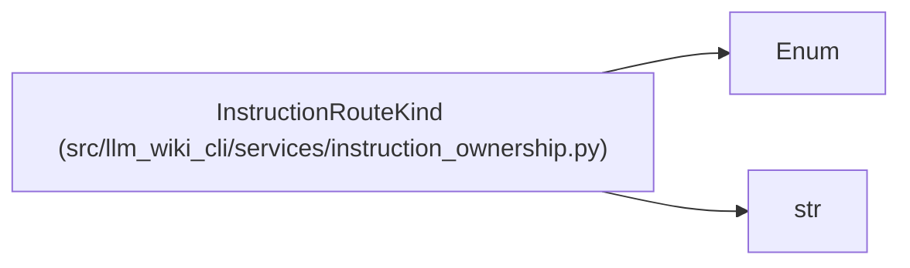

# InstructionRouteKind

**Location:** `src/llm_wiki_cli/services/instruction_ownership.py:55`
**Kind:** Enum
**Bases:** `str`, `Enum`
**Module:** [instruction_ownership](../modules/instruction_ownership.md)

## Description

How a rendered instruction reaches one packaged destination.

## Attributes

| Name | Declared value | Description |
|------|-------|-------------|
| `INSTALLED_PATH` | `'installed_path'` | — |
| `WORKFLOW_SKILL` | `'workflow_skill'` | — |
| `LITERAL` | `'literal'` | — |

## Methods

*No public methods. Inherits from base classes.*

## Relationships

<!-- Auto-generated relationship summary. Do not edit by hand. -->

### Summary

| Module | Methods | Attributes |
|---|---:|---|
| [instruction_ownership](../modules/instruction_ownership.md) | 0 | `INSTALLED_PATH`, `LITERAL`, `WORKFLOW_SKILL` |

### Structure

| Kind | Entity | Module |
|---|---|---|
| Base | `Enum` | — |
| Base | `str` | — |
