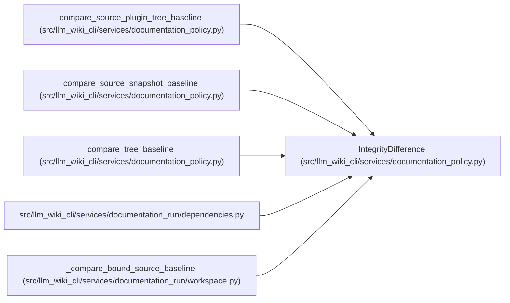

# IntegrityDifference

**Location:** `src/llm_wiki_cli/services/documentation_policy.py:115`
**Kind:** Class
**Bases:** —
**Module:** [documentation_policy](../modules/documentation_policy.md)

**Decorators:** `@dataclass(frozen=True)`

## Description

_Auto-generated from `IntegrityDifference` in `src/llm_wiki_cli/services/documentation_policy.py`._

## Attributes

| Name | Type | Default | Description |
|------|------|---------|-------------|
| `root_display` | `str` | *required* | — |
| `added` | `tuple[str, ...]` | *required* | — |
| `removed` | `tuple[str, ...]` | *required* | — |
| `changed` | `tuple[str, ...]` | *required* | — |

## Methods

| Method | Signature | Decorators | Description |
|--------|-----------|------------|-------------|
| `ok` | `() -> bool` | `@property` | — |
| `to_dict` | `() -> dict[str, Any]` | — | — |

## Relationships

<!-- Auto-generated relationship summary. Do not edit by hand. -->

### Summary

| Module | Methods | Attributes |
|---|---:|---|
| [documentation_policy](../modules/documentation_policy.md) | 2 | `added`, `changed`, `removed`, `root_display` |

### References

| Reference | Kind | Source |
|---|---|---|
| `compare_source_plugin_tree_baseline` | call | [documentation_policy](../modules/documentation_policy.md) |
| `compare_source_plugin_tree_baseline` | type_reference | [documentation_policy](../modules/documentation_policy.md) |
| `compare_source_snapshot_baseline` | call | [documentation_policy](../modules/documentation_policy.md) |
| `compare_source_snapshot_baseline` | type_reference | [documentation_policy](../modules/documentation_policy.md) |
| `compare_tree_baseline` | call | [documentation_policy](../modules/documentation_policy.md) |
| `compare_tree_baseline` | type_reference | [documentation_policy](../modules/documentation_policy.md) |
| `dependencies` | import | [documentation_run_dependencies](../modules/documentation_run_dependencies.md) |
| `_compare_bound_source_baseline` | call | [workspace](../modules/workspace.md) |
