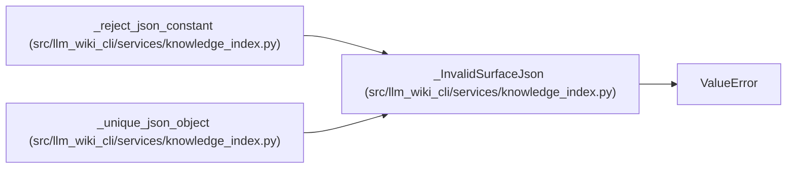

# _InvalidSurfaceJson

**Location:** `src/llm_wiki_cli/services/knowledge_index.py:211`
**Kind:** Class
**Bases:** `ValueError`
**Module:** [knowledge_index](../modules/knowledge_index.md)

## Description

_Auto-generated from `_InvalidSurfaceJson` in `src/llm_wiki_cli/services/knowledge_index.py`._

## Attributes

*No annotated attributes found.*

## Methods

*No public methods. Inherits from base classes.*

## Relationships

<!-- Auto-generated relationship summary. Do not edit by hand. -->

### Summary

| Module | Methods | Attributes |
|---|---:|---|
| [knowledge_index](../modules/knowledge_index.md) | 0 | — |

### Structure

| Kind | Entity | Module |
|---|---|---|
| Base | `ValueError` | — |

### References

| Reference | Kind | Source | Call sites |
|---|---|---|---:|
| `_reject_json_constant` | call | [knowledge_index](../modules/knowledge_index.md) | 1 |
| `_unique_json_object` | call | [knowledge_index](../modules/knowledge_index.md) | 1 |
