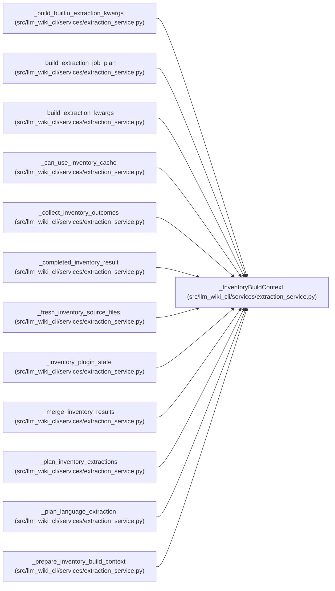

# _InventoryBuildContext

**Location:** `src/llm_wiki_cli/services/extraction_service.py:261`
**Kind:** Class
**Bases:** —
**Module:** [extraction_service](../modules/extraction_service.md)

**Decorators:** `@dataclass`

## Description

_Auto-generated from `_InventoryBuildContext` in `src/llm_wiki_cli/services/extraction_service.py`._

## Attributes

| Name | Type | Default | Description |
|------|------|---------|-------------|
| `request` | `InventoryRequest` | *required* | — |
| `source_snapshot` | `SourceSnapshot` | *required* | — |
| `registry` | `dict[str, str]` | *required* | — |
| `parallel_jobs` | `int` | *required* | — |
| `cache` | `InventoryCache \| None` | *required* | — |
| `cache_key` | `dict \| None` | *required* | — |
| `cache_files` | `dict[str, dict]` | *required* | — |
| `updated_cache_files` | `dict[str, dict]` | *required* | — |
| `source_file_by_path` | `dict[str, SourceFile]` | *required* | — |
| `source_hashes` | `dict[str, str]` | *required* | — |
| `parallel_safe_plugin_entry_points` | `set[str]` | *required* | — |
| `plugin_components` | `tuple[dict, ...]` | *required* | — |
| `plugin_lock_path` | `str \| None` | *required* | — |
| `plugin_lock_hash` | `str \| None` | *required* | — |
| `plugin_root` | `str \| Path` | *required* | — |

## Methods

*No public methods. Inherits from base classes.*

## Relationships

<!-- Auto-generated relationship summary. Do not edit by hand. -->

### Summary

| Module | Methods | Attributes |
|---|---:|---|
| [extraction_service](../modules/extraction_service.md) | 0 | `cache`, `cache_files`, `cache_key`, `parallel_jobs`, `parallel_safe_plugin_entry_points`, `plugin_components`, `plugin_lock_hash`, `plugin_lock_path`, `plugin_root`, `registry`, `request`, `source_file_by_path` |

### References

| Reference | Kind | Source | Call sites |
|---|---|---|---:|
| `_build_builtin_extraction_kwargs` | type_reference | [extraction_service](../modules/extraction_service.md) | — |
| `_build_extraction_job_plan` | type_reference | [extraction_service](../modules/extraction_service.md) | — |
| `_build_extraction_kwargs` | type_reference | [extraction_service](../modules/extraction_service.md) | — |
| `_can_use_inventory_cache` | type_reference | [extraction_service](../modules/extraction_service.md) | — |
| `_collect_inventory_outcomes` | type_reference | [extraction_service](../modules/extraction_service.md) | — |
| `_completed_inventory_result` | type_reference | [extraction_service](../modules/extraction_service.md) | — |
| `_fresh_inventory_source_files` | type_reference | [extraction_service](../modules/extraction_service.md) | — |
| `_inventory_plugin_state` | type_reference | [extraction_service](../modules/extraction_service.md) | — |
| `_merge_inventory_results` | type_reference | [extraction_service](../modules/extraction_service.md) | — |
| `_plan_inventory_extractions` | type_reference | [extraction_service](../modules/extraction_service.md) | — |
| `_plan_language_extraction` | type_reference | [extraction_service](../modules/extraction_service.md) | — |
| `_prepare_inventory_build_context` | call | [extraction_service](../modules/extraction_service.md) | 1 |

> References: showing 12 of 17 logical references; 5 omitted by the 12-row generated summary limit.
