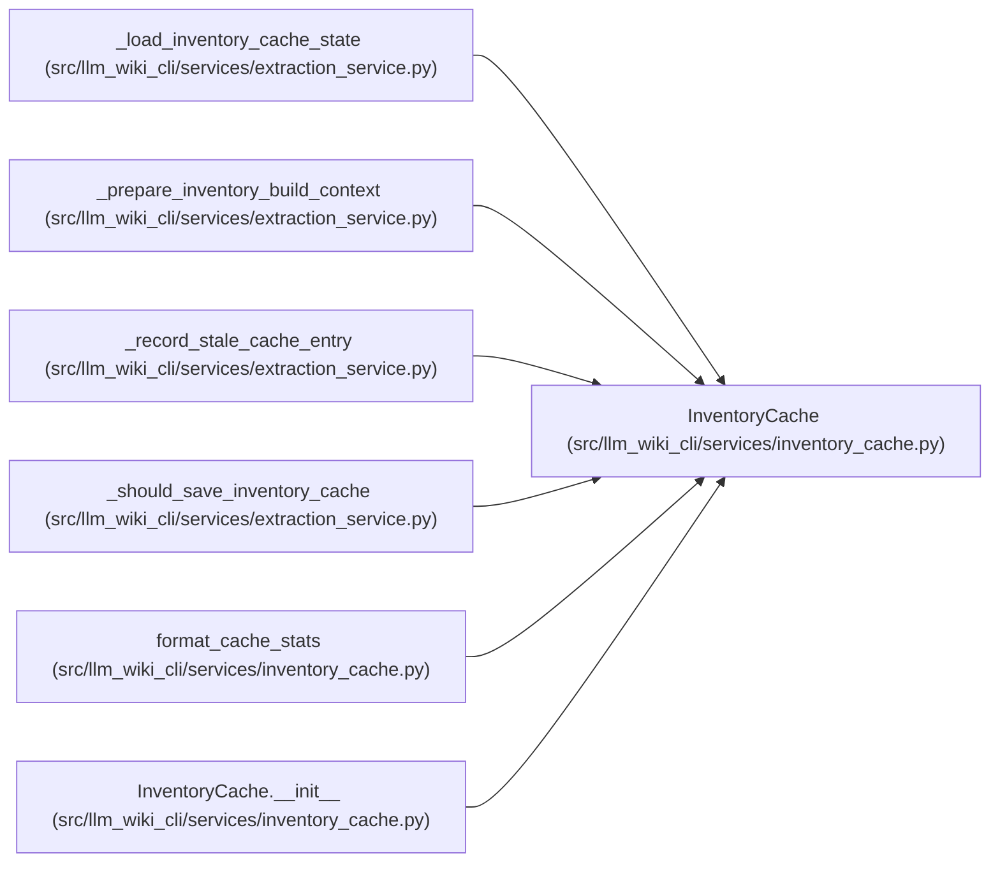

# InventoryCache

**Location:** `src/llm_wiki_cli/services/inventory_cache.py:280`
**Kind:** Class
**Bases:** —
**Module:** [inventory_cache](../modules/inventory_cache.md)

## Description

JSON-backed cache for per-file built-in inventory entries.

## Attributes

*No annotated attributes found.*

## Methods

| Method | Signature | Decorators | Description |
|--------|-----------|------------|-------------|
| `__init__` | `(src_dir: str \| Path, options: InventoryCacheOptions)` | — | — |
| `enabled` | `() -> bool` | `@property` | — |
| `load` | `(cache_key: dict[str, Any]) -> dict[str, dict]` | — | — |
| `finalize_lookup_status` | `() -> None` | — | — |
| `save` | `(cache_key: dict[str, Any], files: dict[str, dict]) -> None` | — | — |

## Relationships

<!-- Auto-generated relationship summary. Do not edit by hand. -->

### Summary

| Module | Methods | Attributes |
|---|---:|---|
| [inventory_cache](../modules/inventory_cache.md) | 5 | — |

### References

| Reference | Kind | Source | Call sites |
|---|---|---|---:|
| `_load_inventory_cache_state` | type_reference | [extraction_service](../modules/extraction_service.md) | — |
| `_prepare_inventory_build_context` | call | [extraction_service](../modules/extraction_service.md) | 1 |
| `_record_stale_cache_entry` | type_reference | [extraction_service](../modules/extraction_service.md) | — |
| `_should_save_inventory_cache` | type_reference | [extraction_service](../modules/extraction_service.md) | — |
| `format_cache_stats` | type_reference | [inventory_cache](../modules/inventory_cache.md) | — |
| `InventoryCache.__init__` | type_reference | [inventory_cache](../modules/inventory_cache.md) | — |
