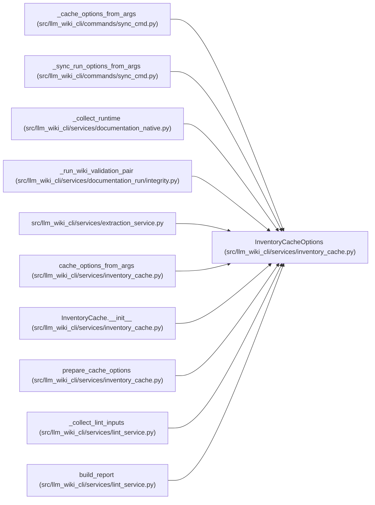

# InventoryCacheOptions

**Location:** `src/llm_wiki_cli/services/inventory_cache.py:42`
**Kind:** Class
**Bases:** —
**Module:** [inventory_cache](../modules/inventory_cache.md)

**Decorators:** `@dataclass(frozen=True)`

## Description

Runtime cache controls for inventory-producing commands.

## Attributes

| Name | Type | Default | Description |
|------|------|---------|-------------|
| `enabled` | `bool` | `False` | — |
| `rebuild` | `bool` | `False` | — |
| `cache_dir` | `str \| None` | `None` | — |
| `stats_enabled` | `bool` | `False` | — |
| `destination` | `RuntimeDestination \| None` | `field(default=None, repr=False, compare=False)` | — |
| `warning` | `WarningSink \| None` | `field(default=None, repr=False, compare=False)` | — |

## Methods

*No public methods. Inherits from base classes.*

## Relationships

<!-- Auto-generated relationship summary. Do not edit by hand. -->

### Summary

| Module | Methods | Attributes |
|---|---:|---|
| [inventory_cache](../modules/inventory_cache.md) | 0 | `cache_dir`, `destination`, `enabled`, `rebuild`, `stats_enabled`, `warning` |

### References

| Reference | Kind | Source | Call sites |
|---|---|---|---:|
| `_cache_options_from_args` | type_reference | [sync_cmd](../modules/sync_cmd.md) | — |
| `_sync_run_options_from_args` | call | [sync_cmd](../modules/sync_cmd.md) | 1 |
| `_collect_runtime` | call | [documentation_native](../modules/documentation_native.md) | 1 |
| `_run_wiki_validation_pair` | call | [integrity](../modules/integrity.md) | 1 |
| `extraction_service` | import | [extraction_service](../modules/extraction_service.md) | — |
| `cache_options_from_args` | call | [inventory_cache](../modules/inventory_cache.md) | 1 |
| `cache_options_from_args` | type_reference | [inventory_cache](../modules/inventory_cache.md) | — |
| `InventoryCache.__init__` | type_reference | [inventory_cache](../modules/inventory_cache.md) | — |
| `prepare_cache_options` | type_reference | [inventory_cache](../modules/inventory_cache.md) | — |
| `_collect_lint_inputs` | type_reference | [lint_service](../modules/lint_service.md) | — |
| `build_report` | type_reference | [lint_service](../modules/lint_service.md) | — |
