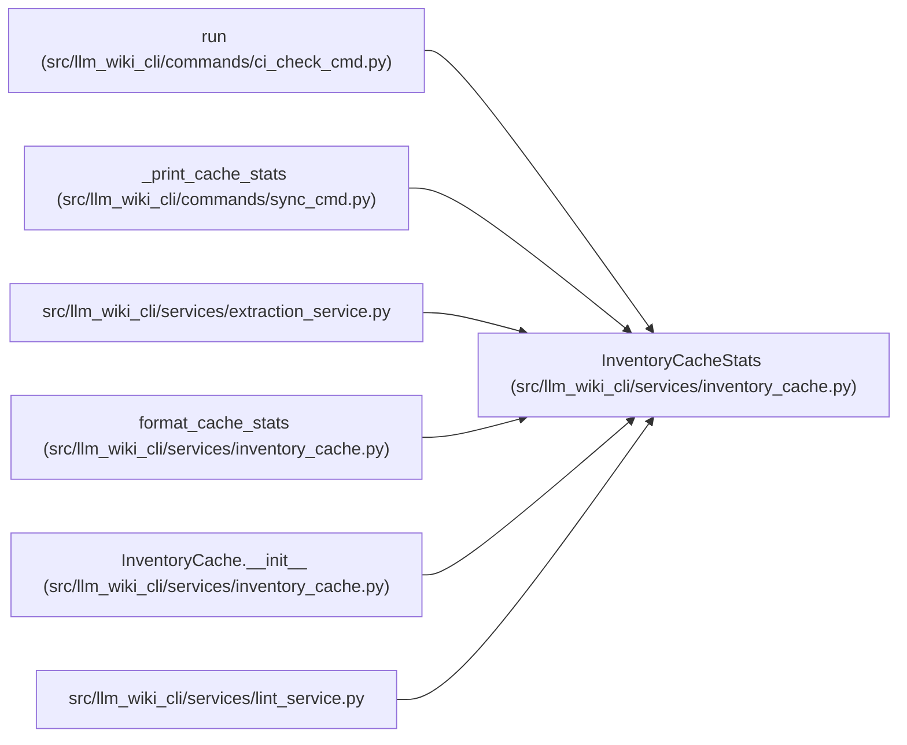

# InventoryCacheStats

**Location:** `src/llm_wiki_cli/services/inventory_cache.py:56`
**Kind:** Class
**Bases:** —
**Module:** [inventory_cache](../modules/inventory_cache.md)

**Decorators:** `@dataclass`

## Description

_Auto-generated from `InventoryCacheStats` in `src/llm_wiki_cli/services/inventory_cache.py`._

## Attributes

| Name | Type | Default | Description |
|------|------|---------|-------------|
| `enabled` | `bool` | `False` | — |
| `path` | `str \| None` | `None` | — |
| `status` | `str` | `'disabled'` | — |
| `hits` | `int` | `0` | — |
| `misses` | `int` | `0` | — |
| `stale` | `int` | `0` | — |
| `changed` | `int` | `0` | — |
| `deleted` | `int` | `0` | — |
| `fresh_extracted` | `int` | `0` | — |
| `saved_entries` | `int` | `0` | — |
| `load_error` | `str` | `''` | — |
| `failure_stage` | `str \| None` | `None` | — |

## Methods

| Method | Signature | Decorators | Description |
|--------|-----------|------------|-------------|
| `to_dict` | `() -> dict[str, Any]` | — | — |

## Relationships

<!-- Auto-generated relationship summary. Do not edit by hand. -->

### Summary

| Module | Methods | Attributes |
|---|---:|---|
| [inventory_cache](../modules/inventory_cache.md) | 1 | `changed`, `deleted`, `enabled`, `failure_stage`, `fresh_extracted`, `hits`, `load_error`, `misses`, `path`, `saved_entries`, `stale`, `status` |

### References

| Reference | Kind | Source | Call sites |
|---|---|---|---:|
| `run` | call | [ci_check_cmd](../modules/ci_check_cmd.md) | 1 |
| `_print_cache_stats` | type_reference | [sync_cmd](../modules/sync_cmd.md) | — |
| `extraction_service` | import | [extraction_service](../modules/extraction_service.md) | — |
| `format_cache_stats` | type_reference | [inventory_cache](../modules/inventory_cache.md) | — |
| `InventoryCache.__init__` | call | [inventory_cache](../modules/inventory_cache.md) | 1 |
| `lint_service` | import | [lint_service](../modules/lint_service.md) | — |
