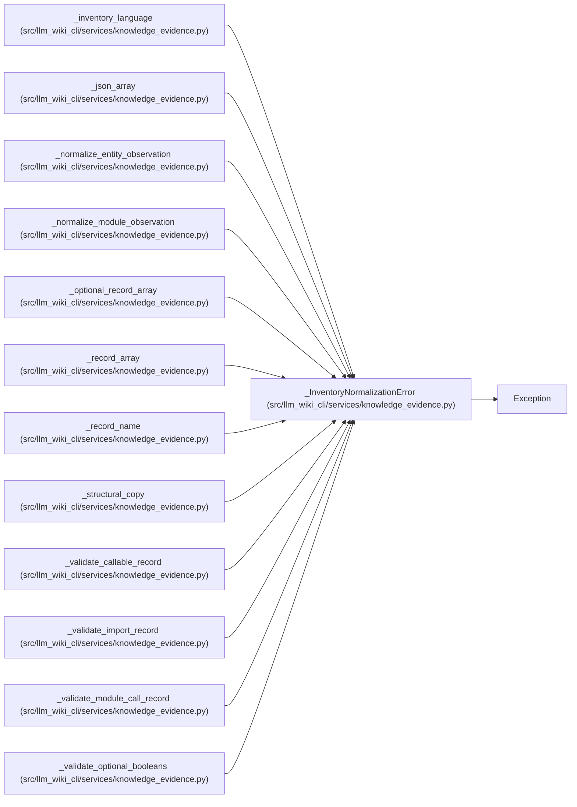

# _InventoryNormalizationError

**Location:** `src/llm_wiki_cli/services/knowledge_evidence.py:143`
**Kind:** Class
**Bases:** `Exception`
**Module:** [knowledge_evidence](../modules/knowledge_evidence.md)

## Description

_Auto-generated from `_InventoryNormalizationError` in `src/llm_wiki_cli/services/knowledge_evidence.py`._

## Attributes

*No annotated attributes found.*

## Methods

| Method | Signature | Decorators | Description |
|--------|-----------|------------|-------------|
| `__init__` | `(reason: str)` | — | — |

## Relationships

<!-- Auto-generated relationship summary. Do not edit by hand. -->

### Summary

| Module | Methods | Attributes |
|---|---:|---|
| [knowledge_evidence](../modules/knowledge_evidence.md) | 1 | — |

### Structure

| Kind | Entity | Module |
|---|---|---|
| Base | `Exception` | — |

### References

| Reference | Kind | Source | Call sites |
|---|---|---|---:|
| `_inventory_language` | call | [knowledge_evidence](../modules/knowledge_evidence.md) | 3 |
| `_json_array` | call | [knowledge_evidence](../modules/knowledge_evidence.md) | 1 |
| `_normalize_entity_observation` | call | [knowledge_evidence](../modules/knowledge_evidence.md) | 1 |
| `_normalize_module_observation` | call | [knowledge_evidence](../modules/knowledge_evidence.md) | 1 |
| `_optional_record_array` | call | [knowledge_evidence](../modules/knowledge_evidence.md) | 1 |
| `_record_array` | call | [knowledge_evidence](../modules/knowledge_evidence.md) | 3 |
| `_record_name` | call | [knowledge_evidence](../modules/knowledge_evidence.md) | 1 |
| `_structural_copy` | call | [knowledge_evidence](../modules/knowledge_evidence.md) | 4 |
| `_validate_callable_record` | call | [knowledge_evidence](../modules/knowledge_evidence.md) | 1 |
| `_validate_import_record` | call | [knowledge_evidence](../modules/knowledge_evidence.md) | 1 |
| `_validate_module_call_record` | call | [knowledge_evidence](../modules/knowledge_evidence.md) | 1 |
| `_validate_optional_booleans` | call | [knowledge_evidence](../modules/knowledge_evidence.md) | 1 |

> References: showing 12 of 17 logical references; 5 omitted by the 12-row generated summary limit.
