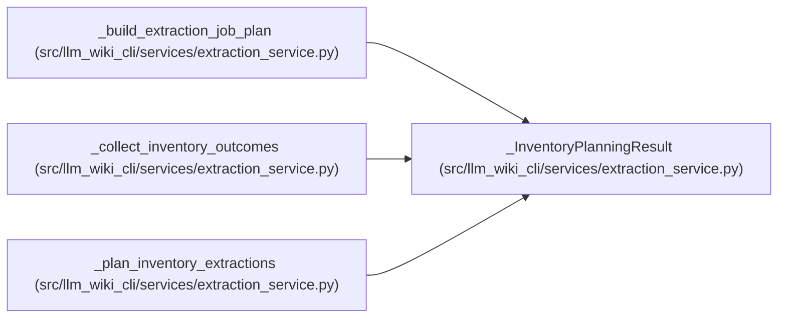

# _InventoryPlanningResult

**Location:** `src/llm_wiki_cli/services/extraction_service.py:280`
**Kind:** Class
**Bases:** —
**Module:** [extraction_service](../modules/extraction_service.md)

**Decorators:** `@dataclass`

## Description

_Auto-generated from `_InventoryPlanningResult` in `src/llm_wiki_cli/services/extraction_service.py`._

## Attributes

| Name | Type | Default | Description |
|------|------|---------|-------------|
| `plans` | `list[_ExtractionPlan]` | *required* | — |
| `status_by_language` | `dict[str, ExtractorStatus]` | *required* | — |
| `cached_by_language` | `dict[str, dict]` | *required* | — |

## Methods

*No public methods. Inherits from base classes.*

## Relationships

<!-- Auto-generated relationship summary. Do not edit by hand. -->

### Summary

| Module | Methods | Attributes |
|---|---:|---|
| [extraction_service](../modules/extraction_service.md) | 0 | `cached_by_language`, `plans`, `status_by_language` |

### References

| Reference | Kind | Source |
|---|---|---|
| `_build_extraction_job_plan` | type_reference | [extraction_service](../modules/extraction_service.md) |
| `_collect_inventory_outcomes` | type_reference | [extraction_service](../modules/extraction_service.md) |
| `_plan_inventory_extractions` | call | [extraction_service](../modules/extraction_service.md) |
| `_plan_inventory_extractions` | type_reference | [extraction_service](../modules/extraction_service.md) |
