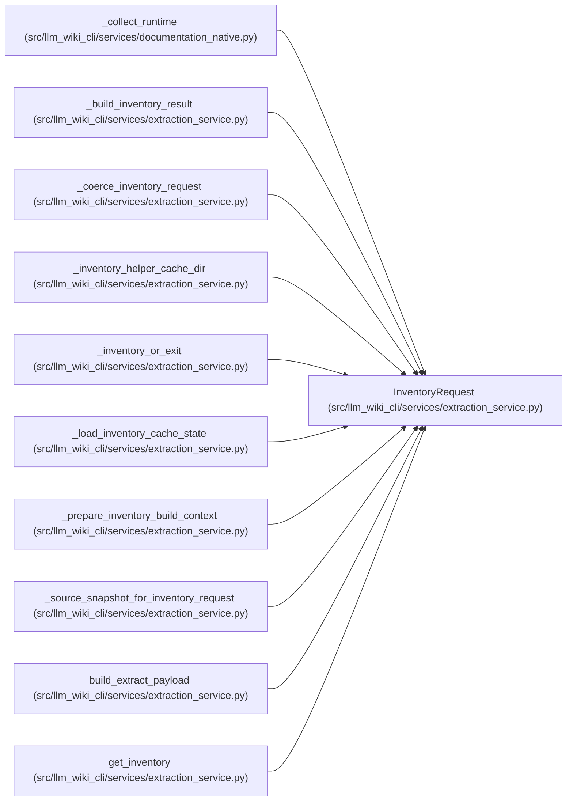

# InventoryRequest

**Location:** `src/llm_wiki_cli/services/extraction_service.py:135`
**Kind:** Class
**Bases:** —
**Module:** [extraction_service](../modules/extraction_service.md)

**Decorators:** `@dataclass(frozen=True)`

## Description

Validated input contract for one extraction pass. It combines the source root
and optional prebuilt snapshot with depth, file narrowing, cache, worker,
helper, plugin, and source-selection controls. Construction normalizes mutable
inputs so the extraction planner receives a stable request.

## Attributes

| Name | Type | Default | Description |
|------|------|---------|-------------|
| `src_dir` | `str \| Path` | *required* | — |
| `deep` | `bool` | `False` | — |
| `only_files` | `list[str] \| None` | `None` | — |
| `include_empty` | `bool` | `False` | — |
| `source_snapshot` | `SourceSnapshot \| None` | `None` | — |
| `cache_options` | `InventoryCacheOptions \| None` | `None` | — |
| `parallel_jobs` | `int` | `1` | — |
| `helper_cache_dir` | `str \| None` | `None` | — |
| `include_tests` | `Iterable[str] \| None` | `None` | — |
| `job_request` | `ExtractionJobRequest \| None` | `None` | — |
| `plan_reporter` | `Callable[[ExtractionJobPlan], None] \| None` | `None` | — |
| `include_plugins` | `bool` | `True` | — |
| `capture_data_effect_observations` | `bool` | `False` | — |
| `capture_import_observations` | `bool` | `False` | — |
| `source_selection` | `str \| Path \| None` | `None` | — |
| `source_plugins_only` | `bool` | `False` | — |

## Methods

| Method | Signature | Decorators | Description |
|--------|-----------|------------|-------------|
| `__post_init__` | `() -> None` | — | — |

## Relationships

<!-- Auto-generated relationship summary. Do not edit by hand. -->

### Summary

| Module | Methods | Attributes |
|---|---:|---|
| [extraction_service](../modules/extraction_service.md) | 1 | `cache_options`, `capture_data_effect_observations`, `capture_import_observations`, `deep`, `helper_cache_dir`, `include_empty`, `include_plugins`, `include_tests`, `job_request`, `only_files`, `parallel_jobs`, `plan_reporter` |

### References

| Reference | Kind | Source |
|---|---|---|
| `_collect_runtime` | call | [documentation_native](../modules/documentation_native.md) |
| `_build_inventory_result` | type_reference | [extraction_service](../modules/extraction_service.md) |
| `_coerce_inventory_request` | call | [extraction_service](../modules/extraction_service.md) |
| `_coerce_inventory_request` | type_reference | [extraction_service](../modules/extraction_service.md) |
| `_inventory_helper_cache_dir` | type_reference | [extraction_service](../modules/extraction_service.md) |
| `_inventory_or_exit` | call | [extraction_service](../modules/extraction_service.md) |
| `_load_inventory_cache_state` | type_reference | [extraction_service](../modules/extraction_service.md) |
| `_prepare_inventory_build_context` | type_reference | [extraction_service](../modules/extraction_service.md) |
| `_source_snapshot_for_inventory_request` | type_reference | [extraction_service](../modules/extraction_service.md) |
| `build_extract_payload` | call | [extraction_service](../modules/extraction_service.md) |
| `build_extract_payload` | call | [extraction_service](../modules/extraction_service.md) |
| `get_inventory` | call | [extraction_service](../modules/extraction_service.md) |
