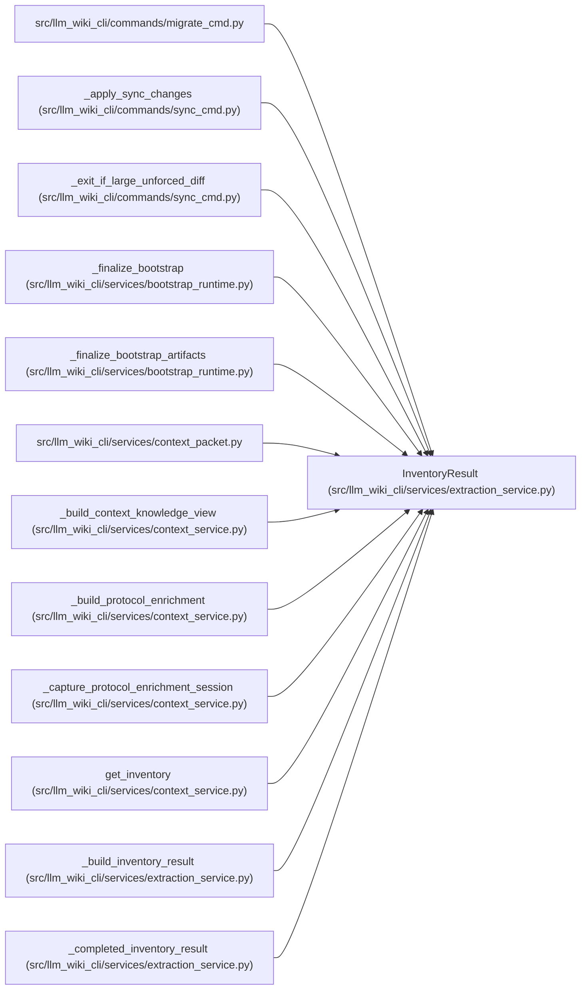

# InventoryResult

**Location:** `src/llm_wiki_cli/services/extraction_service.py:160`
**Kind:** Class
**Bases:** —
**Module:** [extraction_service](../modules/extraction_service.md)

**Decorators:** `@dataclass(frozen=True)`

## Description

Complete extraction outcome shared by generation, context, review, and
validation callers. Alongside merged inventory it carries per-extractor
statuses, the effective job plan, cache statistics, plugin producer metadata,
the exact source snapshot, and optional observation maps. The `failed`
property gives callers a single fail-closed check across extractor statuses.

## Attributes

| Name | Type | Default | Description |
|------|------|---------|-------------|
| `inventory` | `dict` | *required* | — |
| `statuses` | `dict[str, ExtractorStatus]` | *required* | — |
| `cache_stats` | `InventoryCacheStats \| None` | `None` | — |
| `extraction_job_plan` | `ExtractionJobPlan` | `field(default_factory=ExtractionJobPlan)` | — |
| `extractor_registry` | `dict[str, str]` | `field(default_factory=dict)` | — |
| `plugin_components` | `tuple[dict, ...]` | `()` | — |
| `producer_plugin_components` | `tuple[dict, ...]` | `()` | — |
| `plugin_lock_path` | `str \| None` | `None` | — |
| `plugin_lock_hash` | `str \| None` | `None` | — |
| `source_snapshot` | `SourceSnapshot \| None` | `None` | — |
| `data_effect_observations` | `dict \| None` | `field(default=None, repr=False, compare=False)` | — |
| `import_observations` | `dict \| None` | `field(default=None, repr=False, compare=False)` | — |

## Methods

| Method | Signature | Decorators | Description |
|--------|-----------|------------|-------------|
| `job_plan` | `() -> ExtractionJobPlan` | `@property` | — |
| `failed` | `() -> list[ExtractorStatus]` | `@property` | — |

## Relationships

<!-- Auto-generated relationship summary. Do not edit by hand. -->

### Summary

| Module | Methods | Attributes |
|---|---:|---|
| [extraction_service](../modules/extraction_service.md) | 2 | `cache_stats`, `data_effect_observations`, `extraction_job_plan`, `extractor_registry`, `import_observations`, `inventory`, `plugin_components`, `plugin_lock_hash`, `plugin_lock_path`, `producer_plugin_components`, `source_snapshot`, `statuses` |

### References

| Reference | Kind | Source | Call sites |
|---|---|---|---:|
| `migrate_cmd` | import | [migrate_cmd](../modules/migrate_cmd.md) | — |
| `_apply_sync_changes` | type_reference | [sync_cmd](../modules/sync_cmd.md) | — |
| `_exit_if_large_unforced_diff` | type_reference | [sync_cmd](../modules/sync_cmd.md) | — |
| `_finalize_bootstrap` | type_reference | [bootstrap_runtime](../modules/bootstrap_runtime.md) | — |
| `_finalize_bootstrap_artifacts` | type_reference | [bootstrap_runtime](../modules/bootstrap_runtime.md) | — |
| `context_packet` | import | [context_packet](../modules/context_packet.md) | — |
| `_build_context_knowledge_view` | type_reference | [context_service](../modules/context_service.md) | — |
| `_build_protocol_enrichment` | type_reference | [context_service](../modules/context_service.md) | — |
| `_capture_protocol_enrichment_session` | type_reference | [context_service](../modules/context_service.md) | — |
| `get_inventory` | type_reference | [context_service](../modules/context_service.md) | — |
| `_build_inventory_result` | type_reference | [extraction_service](../modules/extraction_service.md) | — |
| `_completed_inventory_result` | call | [extraction_service](../modules/extraction_service.md) | 1 |

> References: showing 12 of 20 logical references; 8 omitted by the 12-row generated summary limit.
