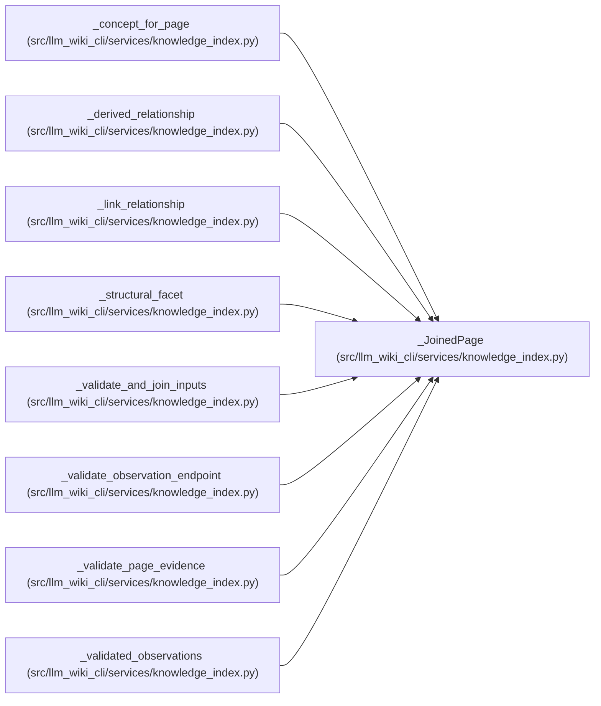

# _JoinedPage

**Location:** `src/llm_wiki_cli/services/knowledge_index.py:174`
**Kind:** Class
**Bases:** —
**Module:** [knowledge_index](../modules/knowledge_index.md)

**Decorators:** `@dataclass(frozen=True)`

## Description

_Auto-generated from `_JoinedPage` in `src/llm_wiki_cli/services/knowledge_index.py`._

## Attributes

| Name | Type | Default | Description |
|------|------|---------|-------------|
| `page` | `WikiSurfacePage` | *required* | — |
| `surface` | `_SurfacePage` | *required* | — |
| `content` | `str` | *required* | — |
| `page_hash` | `str` | *required* | — |
| `mapping` | `ManifestPageSource \| None` | *required* | — |
| `baseline` | `ManifestEvidenceBaseline \| None` | *required* | — |
| `tombstone` | `ManifestTombstone \| None` | *required* | — |
| `infrastructure_basis` | `ConceptObservationBasis \| None` | *required* | — |

## Methods

| Method | Signature | Decorators | Description |
|--------|-----------|------------|-------------|
| `basis` | `() -> ConceptObservationBasis \| None` | `@property` | — |

## Relationships

<!-- Auto-generated relationship summary. Do not edit by hand. -->

### Summary

| Module | Methods | Attributes |
|---|---:|---|
| [knowledge_index](../modules/knowledge_index.md) | 1 | `baseline`, `content`, `infrastructure_basis`, `mapping`, `page`, `page_hash`, `surface`, `tombstone` |

### References

| Reference | Kind | Source | Call sites |
|---|---|---|---:|
| `_concept_for_page` | type_reference | [knowledge_index](../modules/knowledge_index.md) | — |
| `_derived_relationship` | type_reference | [knowledge_index](../modules/knowledge_index.md) | — |
| `_link_relationship` | type_reference | [knowledge_index](../modules/knowledge_index.md) | — |
| `_structural_facet` | type_reference | [knowledge_index](../modules/knowledge_index.md) | — |
| `_validate_and_join_inputs` | call | [knowledge_index](../modules/knowledge_index.md) | 1 |
| `_validate_observation_endpoint` | type_reference | [knowledge_index](../modules/knowledge_index.md) | — |
| `_validate_page_evidence` | type_reference | [knowledge_index](../modules/knowledge_index.md) | — |
| `_validated_observations` | type_reference | [knowledge_index](../modules/knowledge_index.md) | — |
