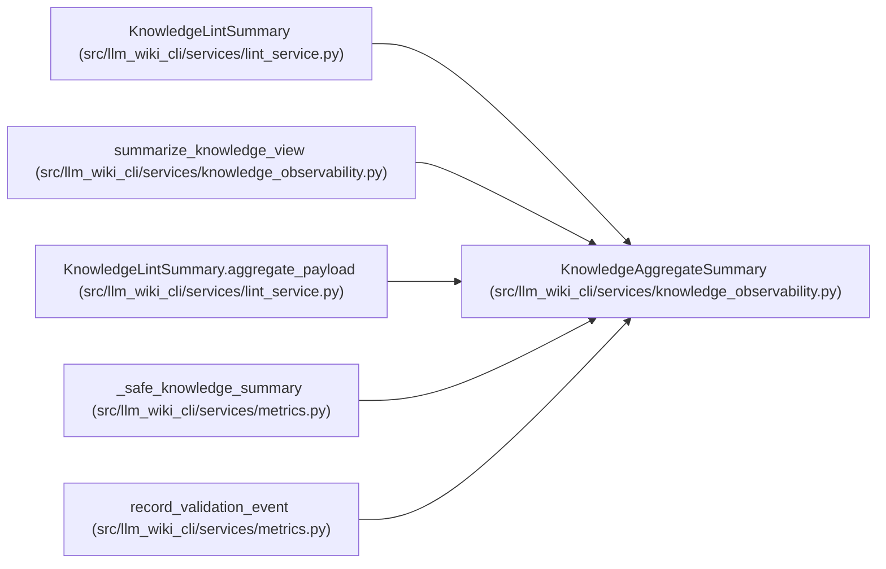

# KnowledgeAggregateSummary

**Location:** `src/llm_wiki_cli/services/knowledge_observability.py:225`
**Kind:** Class
**Bases:** —
**Module:** [knowledge_observability](../modules/knowledge_observability.md)

**Decorators:** `@dataclass(frozen=True)`

## Description

Low-cardinality knowledge status safe for reports and local metrics.

## Attributes

| Name | Type | Default | Description |
|------|------|---------|-------------|
| `availability` | `str` | *required* | — |
| `reason` | `str` | *required* | — |
| `concepts_evaluated` | `int` | *required* | — |
| `freshness_counts` | `Mapping[str, int] \| None` | *required* | — |
| `evidence_issue_counts` | `Mapping[str, int] \| None` | *required* | — |
| `degraded_reason` | `str \| None` | *required* | — |
| `phase_durations_ms` | `Mapping[str, int \| None]` | *required* | — |
| `freshness_evaluated` | `bool` | *required* | — |

## Methods

| Method | Signature | Decorators | Description |
|--------|-----------|------------|-------------|
| `__post_init__` | `() -> None` | — | — |
| `to_payload` | `() -> dict[str, object]` | — | — |
| `freshness` | `() -> str` | `@property` | Return the required user-facing freshness disclosure. |

## Relationships

<!-- Auto-generated relationship summary. Do not edit by hand. -->

### Summary

| Module | Methods | Attributes |
|---|---:|---|
| [knowledge_observability](../modules/knowledge_observability.md) | 3 | `availability`, `concepts_evaluated`, `degraded_reason`, `evidence_issue_counts`, `freshness_counts`, `freshness_evaluated`, `phase_durations_ms`, `reason` |

### Structure

| Kind | Entity | Module |
|---|---|---|
| Subclass | `KnowledgeLintSummary` | [lint_service](../modules/lint_service.md) |

### References

| Reference | Kind | Source |
|---|---|---|
| `summarize_knowledge_view` | call | [knowledge_observability](../modules/knowledge_observability.md) |
| `summarize_knowledge_view` | type_reference | [knowledge_observability](../modules/knowledge_observability.md) |
| `KnowledgeLintSummary.aggregate_payload` | call | [lint_service](../modules/lint_service.md) |
| `_safe_knowledge_summary` | call | [metrics](../modules/metrics.md) |
| `_safe_knowledge_summary` | type_reference | [metrics](../modules/metrics.md) |
| `record_validation_event` | type_reference | [metrics](../modules/metrics.md) |
