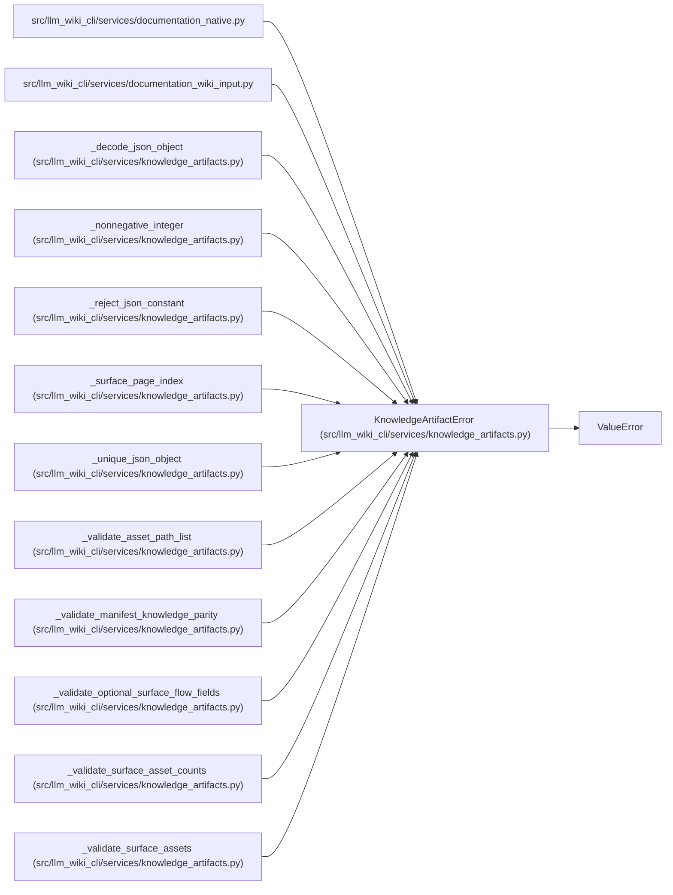

# KnowledgeArtifactError

**Location:** `src/llm_wiki_cli/services/knowledge_artifacts.py:71`
**Kind:** Class
**Bases:** `ValueError`
**Module:** [knowledge_artifacts](../modules/knowledge_artifacts.md)

## Description

Field-specific failure while planning a generated artifact commit.

## Attributes

*No annotated attributes found.*

## Methods

| Method | Signature | Decorators | Description |
|--------|-----------|------------|-------------|
| `__init__` | `(field: str, message: str, *, code: str \| None = None)` | — | — |

## Relationships

<!-- Auto-generated relationship summary. Do not edit by hand. -->

### Summary

| Module | Methods | Attributes |
|---|---:|---|
| [knowledge_artifacts](../modules/knowledge_artifacts.md) | 1 | — |

### Structure

| Kind | Entity | Module |
|---|---|---|
| Base | `ValueError` | — |

### References

| Reference | Kind | Source | Call sites |
|---|---|---|---:|
| `documentation_native` | import | [documentation_native](../modules/documentation_native.md) | — |
| `documentation_wiki_input` | import | [documentation_wiki_input](../modules/documentation_wiki_input.md) | — |
| `_decode_json_object` | call | [knowledge_artifacts](../modules/knowledge_artifacts.md) | 4 |
| `_nonnegative_integer` | call | [knowledge_artifacts](../modules/knowledge_artifacts.md) | 1 |
| `_reject_json_constant` | call | [knowledge_artifacts](../modules/knowledge_artifacts.md) | 1 |
| `_surface_page_index` | call | [knowledge_artifacts](../modules/knowledge_artifacts.md) | 15 |
| `_unique_json_object` | call | [knowledge_artifacts](../modules/knowledge_artifacts.md) | 1 |
| `_validate_asset_path_list` | call | [knowledge_artifacts](../modules/knowledge_artifacts.md) | 3 |
| `_validate_manifest_knowledge_parity` | call | [knowledge_artifacts](../modules/knowledge_artifacts.md) | 16 |
| `_validate_optional_surface_flow_fields` | call | [knowledge_artifacts](../modules/knowledge_artifacts.md) | 1 |
| `_validate_surface_asset_counts` | call | [knowledge_artifacts](../modules/knowledge_artifacts.md) | 6 |
| `_validate_surface_assets` | call | [knowledge_artifacts](../modules/knowledge_artifacts.md) | 6 |

> References: showing 12 of 29 logical references; 17 omitted by the 12-row generated summary limit.
