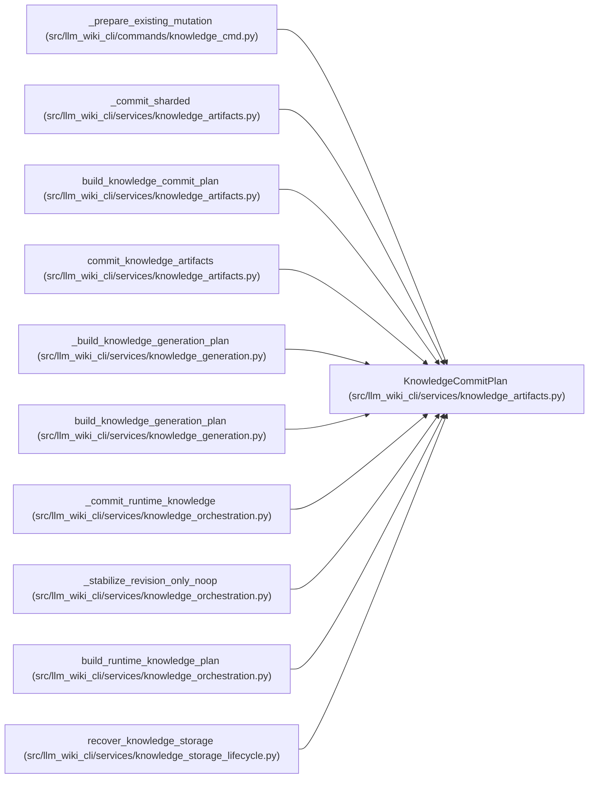

# KnowledgeCommitPlan

**Location:** `src/llm_wiki_cli/services/knowledge_artifacts.py:190`
**Kind:** Class
**Bases:** —
**Module:** [knowledge_artifacts](../modules/knowledge_artifacts.md)

**Decorators:** `@dataclass(frozen=True)`

## Description

A fully validated, immutable three-artifact commit plan.

## Attributes

| Name | Type | Default | Description |
|------|------|---------|-------------|
| `surface_index` | `PlannedArtifactWrite` | *required* | — |
| `knowledge_index` | `PlannedArtifactWrite` | *required* | — |
| `manifest` | `PlannedArtifactWrite` | *required* | — |
| `committed_manifest` | `SyncManifest` | *required* | — |
| `evaluated_envelope_hash` | `str` | *required* | — |
| `storage_objects` | `tuple[PlannedArtifactWrite, ...]` | `()` | — |
| `storage_format` | `str` | `'v1'` | — |

## Methods

| Method | Signature | Decorators | Description |
|--------|-----------|------------|-------------|
| `changed` | `() -> bool` | `@property` | — |

## Relationships

<!-- Auto-generated relationship summary. Do not edit by hand. -->

### Summary

| Module | Methods | Attributes |
|---|---:|---|
| [knowledge_artifacts](../modules/knowledge_artifacts.md) | 1 | `committed_manifest`, `evaluated_envelope_hash`, `knowledge_index`, `manifest`, `storage_format`, `storage_objects`, `surface_index` |

### References

| Reference | Kind | Source | Call sites |
|---|---|---|---:|
| `_prepare_existing_mutation` | type_reference | [knowledge_cmd](../modules/knowledge_cmd.md) | — |
| `_commit_sharded` | type_reference | [knowledge_artifacts](../modules/knowledge_artifacts.md) | — |
| `build_knowledge_commit_plan` | call | [knowledge_artifacts](../modules/knowledge_artifacts.md) | 1 |
| `build_knowledge_commit_plan` | type_reference | [knowledge_artifacts](../modules/knowledge_artifacts.md) | — |
| `commit_knowledge_artifacts` | type_reference | [knowledge_artifacts](../modules/knowledge_artifacts.md) | — |
| `_build_knowledge_generation_plan` | type_reference | [knowledge_generation](../modules/knowledge_generation.md) | — |
| `build_knowledge_generation_plan` | type_reference | [knowledge_generation](../modules/knowledge_generation.md) | — |
| `_commit_runtime_knowledge` | type_reference | [knowledge_orchestration](../modules/knowledge_orchestration.md) | — |
| `_stabilize_revision_only_noop` | type_reference | [knowledge_orchestration](../modules/knowledge_orchestration.md) | — |
| `build_runtime_knowledge_plan` | type_reference | [knowledge_orchestration](../modules/knowledge_orchestration.md) | — |
| `recover_knowledge_storage` | call | [knowledge_storage_lifecycle](../modules/knowledge_storage_lifecycle.md) | 1 |
