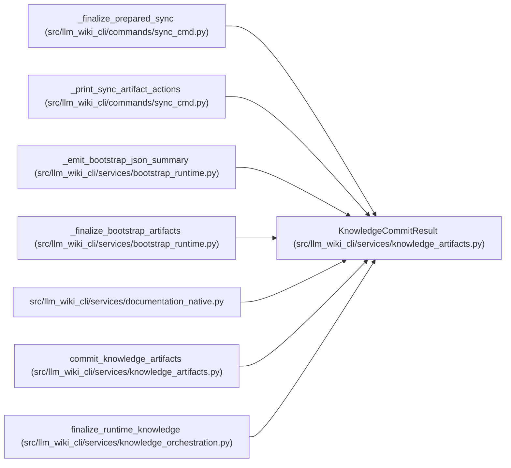

# KnowledgeCommitResult

**Location:** `src/llm_wiki_cli/services/knowledge_artifacts.py:144`
**Kind:** Class
**Bases:** —
**Module:** [knowledge_artifacts](../modules/knowledge_artifacts.md)

**Decorators:** `@dataclass(frozen=True)`

## Description

Outcome of a real or dry-run commit.

## Attributes

| Name | Type | Default | Description |
|------|------|---------|-------------|
| `surface_index` | `PlannedArtifactWrite` | *required* | — |
| `knowledge_index` | `PlannedArtifactWrite` | *required* | — |
| `manifest` | `PlannedArtifactWrite` | *required* | — |
| `committed_manifest` | `SyncManifest` | *required* | — |
| `evaluated_envelope_hash` | `str` | *required* | — |
| `dry_run` | `bool` | *required* | — |

## Methods

| Method | Signature | Decorators | Description |
|--------|-----------|------------|-------------|
| `changed` | `() -> bool` | `@property` | — |

## Relationships

<!-- Auto-generated relationship summary. Do not edit by hand. -->

### Summary

| Module | Methods | Attributes |
|---|---:|---|
| [knowledge_artifacts](../modules/knowledge_artifacts.md) | 1 | `committed_manifest`, `dry_run`, `evaluated_envelope_hash`, `knowledge_index`, `manifest`, `surface_index` |

### References

| Reference | Kind | Source | Call sites |
|---|---|---|---:|
| `_finalize_prepared_sync` | type_reference | [sync_cmd](../modules/sync_cmd.md) | — |
| `_print_sync_artifact_actions` | type_reference | [sync_cmd](../modules/sync_cmd.md) | — |
| `_emit_bootstrap_json_summary` | type_reference | [bootstrap_runtime](../modules/bootstrap_runtime.md) | — |
| `_finalize_bootstrap_artifacts` | type_reference | [bootstrap_runtime](../modules/bootstrap_runtime.md) | — |
| `documentation_native` | import | [documentation_native](../modules/documentation_native.md) | — |
| `commit_knowledge_artifacts` | call | [knowledge_artifacts](../modules/knowledge_artifacts.md) | 1 |
| `commit_knowledge_artifacts` | type_reference | [knowledge_artifacts](../modules/knowledge_artifacts.md) | — |
| `finalize_runtime_knowledge` | type_reference | [knowledge_orchestration](../modules/knowledge_orchestration.md) | — |
