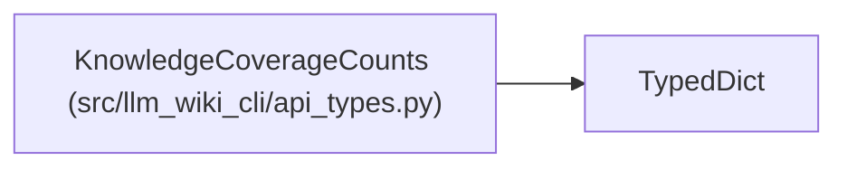

# KnowledgeCoverageCounts

**Location:** `src/llm_wiki_cli/api_types.py:17`
**Kind:** Class
**Bases:** `TypedDict`
**Module:** [api_types](../modules/api_types.md)

## Description

_Auto-generated from `KnowledgeCoverageCounts` in `src/llm_wiki_cli/api_types.py`._

## Attributes

| Name | Type | Presence | Description |
|------|------|----------|-------------|
| `total` | `int` | *required* | — |
| `modeled` | `int` | *required* | — |
| `unmodeled` | `int` | *required* | — |
| `compared` | `int` | *required* | — |
| `modeled_freshness` | `dict[str, int] \| None` | *required* | — |

## Methods

*No public methods. Inherits from base classes.*

## Relationships

<!-- Auto-generated relationship summary. Do not edit by hand. -->

### Summary

| Module | Methods | Attributes |
|---|---:|---|
| [api_types](../modules/api_types.md) | 0 | `compared`, `modeled`, `modeled_freshness`, `total`, `unmodeled` |

### Structure

| Kind | Entity | Module |
|---|---|---|
| Base | `TypedDict` | — |
