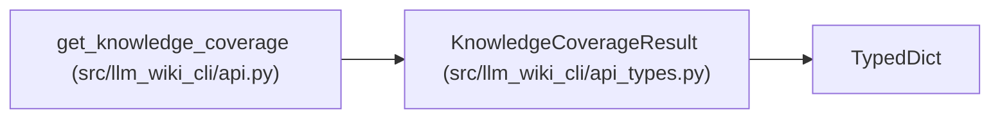

# KnowledgeCoverageResult

**Location:** `src/llm_wiki_cli/api_types.py:102`
**Kind:** Class
**Bases:** `TypedDict`
**Module:** [api_types](../modules/api_types.md)

## Description

Versioned aggregate diagnostics without identities or raw evidence.

## Attributes

| Name | Type | Presence | Description |
|------|------|----------|-------------|
| `schema_version` | `str` | *required* | — |
| `availability` | `str` | *required* | — |
| `reason` | `str` | *required* | — |
| `read_scope` | `str` | *required* | — |
| `freshness_evaluated` | `bool` | *required* | — |
| `counts` | `KnowledgeCoverageCounts \| None` | *required* | — |
| `by_kind` | `dict[str, KnowledgeCoverageCounts] \| None` | *required* | — |
| `reasons` | `dict[str, int] \| None` | *required* | — |

## Methods

*No public methods. Inherits from base classes.*

## Relationships

<!-- Auto-generated relationship summary. Do not edit by hand. -->

### Summary

| Module | Methods | Attributes |
|---|---:|---|
| [api_types](../modules/api_types.md) | 0 | `availability`, `by_kind`, `counts`, `freshness_evaluated`, `read_scope`, `reason`, `reasons`, `schema_version` |

### Structure

| Kind | Entity | Module |
|---|---|---|
| Base | `TypedDict` | — |

### References

| Reference | Kind | Source | Call sites |
|---|---|---|---:|
| `get_knowledge_coverage` | type_reference | [api](../modules/api.md) | — |
