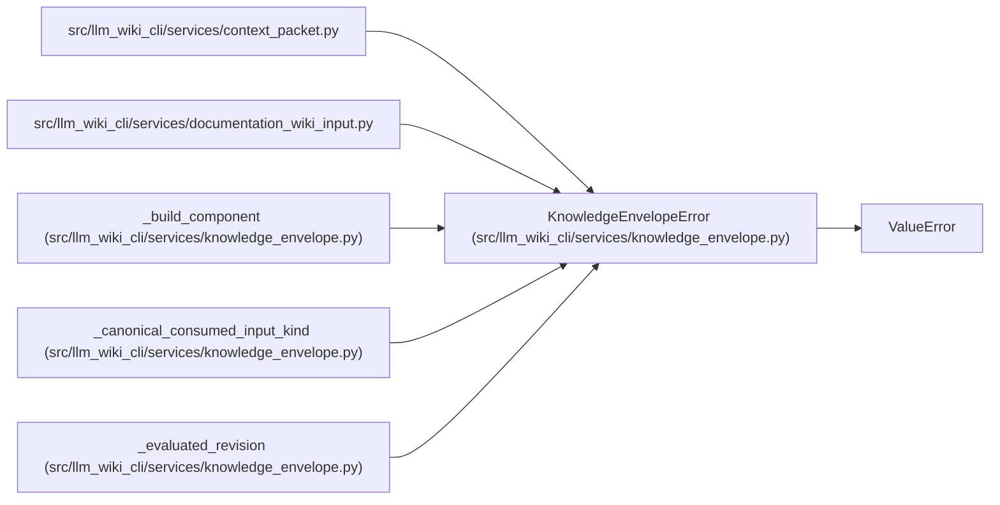

# KnowledgeEnvelopeError

**Location:** `src/llm_wiki_cli/services/knowledge_envelope.py:86`
**Kind:** Class
**Bases:** `ValueError`
**Module:** [knowledge_envelope](../modules/knowledge_envelope.md)

## Description

Field-specific validation failure while constructing an envelope.

## Attributes

*No annotated attributes found.*

## Methods

| Method | Signature | Decorators | Description |
|--------|-----------|------------|-------------|
| `__init__` | `(field: str, message: str)` | — | — |

## Relationships

<!-- Auto-generated relationship summary. Do not edit by hand. -->

### Summary

| Module | Methods | Attributes |
|---|---:|---|
| [knowledge_envelope](../modules/knowledge_envelope.md) | 1 | — |

### Structure

| Kind | Entity | Module |
|---|---|---|
| Base | `ValueError` | — |

### References

| Reference | Kind | Source |
|---|---|---|
| `context_packet` | import | [context_packet](../modules/context_packet.md) |
| `documentation_wiki_input` | import | [documentation_wiki_input](../modules/documentation_wiki_input.md) |
| `_build_component` | call | [knowledge_envelope](../modules/knowledge_envelope.md) |
| `_build_component` | call | [knowledge_envelope](../modules/knowledge_envelope.md) |
| `_build_component` | call | [knowledge_envelope](../modules/knowledge_envelope.md) |
| `_build_component` | call | [knowledge_envelope](../modules/knowledge_envelope.md) |
| `_build_component` | call | [knowledge_envelope](../modules/knowledge_envelope.md) |
| `_canonical_consumed_input_kind` | call | [knowledge_envelope](../modules/knowledge_envelope.md) |
| `_canonical_consumed_input_kind` | call | [knowledge_envelope](../modules/knowledge_envelope.md) |
| `_canonical_consumed_input_kind` | call | [knowledge_envelope](../modules/knowledge_envelope.md) |
| `_canonical_consumed_input_kind` | call | [knowledge_envelope](../modules/knowledge_envelope.md) |
| `_evaluated_revision` | call | [knowledge_envelope](../modules/knowledge_envelope.md) |
