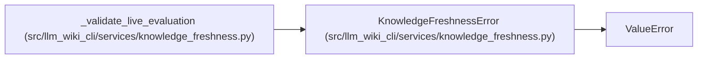

# KnowledgeFreshnessError

**Location:** `src/llm_wiki_cli/services/knowledge_freshness.py:149`
**Kind:** Class
**Bases:** `ValueError`
**Module:** [knowledge_freshness](../modules/knowledge_freshness.md)

## Description

Field-specific failure at the pure live-comparison boundary.

## Attributes

*No annotated attributes found.*

## Methods

| Method | Signature | Decorators | Description |
|--------|-----------|------------|-------------|
| `__init__` | `(field: str, message: str)` | — | — |

## Relationships

<!-- Auto-generated relationship summary. Do not edit by hand. -->

### Summary

| Module | Methods | Attributes |
|---|---:|---|
| [knowledge_freshness](../modules/knowledge_freshness.md) | 1 | — |

### Structure

| Kind | Entity | Module |
|---|---|---|
| Base | `ValueError` | — |

### References

| Reference | Kind | Source |
|---|---|---|
| `_validate_live_evaluation` | call | [knowledge_freshness](../modules/knowledge_freshness.md) |
| `_validate_live_evaluation` | call | [knowledge_freshness](../modules/knowledge_freshness.md) |
| `_validate_live_evaluation` | call | [knowledge_freshness](../modules/knowledge_freshness.md) |
| `_validate_live_evaluation` | call | [knowledge_freshness](../modules/knowledge_freshness.md) |
| `_validate_live_evaluation` | call | [knowledge_freshness](../modules/knowledge_freshness.md) |
| `_validate_live_evaluation` | call | [knowledge_freshness](../modules/knowledge_freshness.md) |
| `_validate_live_evaluation` | call | [knowledge_freshness](../modules/knowledge_freshness.md) |
| `_validate_live_evaluation` | call | [knowledge_freshness](../modules/knowledge_freshness.md) |
| `_validate_live_evaluation` | call | [knowledge_freshness](../modules/knowledge_freshness.md) |
| `_validate_live_evaluation` | call | [knowledge_freshness](../modules/knowledge_freshness.md) |
| `_validate_live_evaluation` | call | [knowledge_freshness](../modules/knowledge_freshness.md) |
| `_validate_live_evaluation` | call | [knowledge_freshness](../modules/knowledge_freshness.md) |
