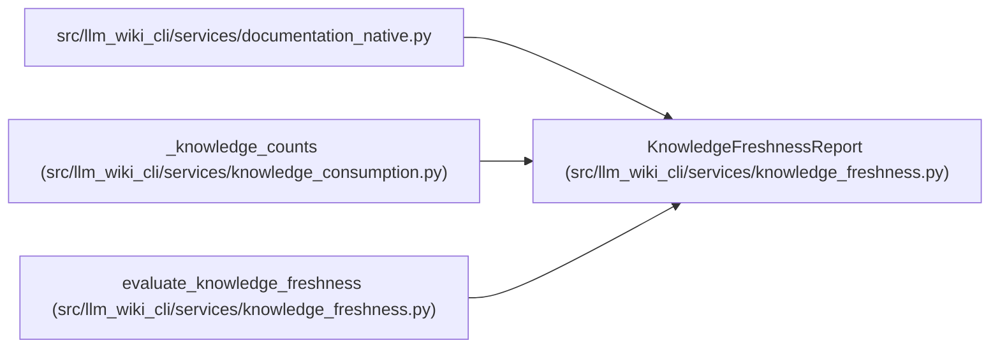

# KnowledgeFreshnessReport

**Location:** `src/llm_wiki_cli/services/knowledge_freshness.py:203`
**Kind:** Class
**Bases:** —
**Module:** [knowledge_freshness](../modules/knowledge_freshness.md)

**Decorators:** `@dataclass(frozen=True)`

## Description

Freshness results for every recorded concept and aggregate counts.

## Attributes

| Name | Type | Default | Description |
|------|------|---------|-------------|
| `by_locator` | `Mapping[str, ConceptFreshnessResult]` | *required* | — |
| `counts` | `Mapping[ComputedFreshness, int]` | *required* | — |

## Methods

*No public methods. Inherits from base classes.*

## Relationships

<!-- Auto-generated relationship summary. Do not edit by hand. -->

### Summary

| Module | Methods | Attributes |
|---|---:|---|
| [knowledge_freshness](../modules/knowledge_freshness.md) | 0 | `by_locator`, `counts` |

### References

| Reference | Kind | Source | Call sites |
|---|---|---|---:|
| `documentation_native` | import | [documentation_native](../modules/documentation_native.md) | — |
| `_knowledge_counts` | type_reference | [knowledge_consumption](../modules/knowledge_consumption.md) | — |
| `evaluate_knowledge_freshness` | call | [knowledge_freshness](../modules/knowledge_freshness.md) | 1 |
| `evaluate_knowledge_freshness` | type_reference | [knowledge_freshness](../modules/knowledge_freshness.md) | — |
