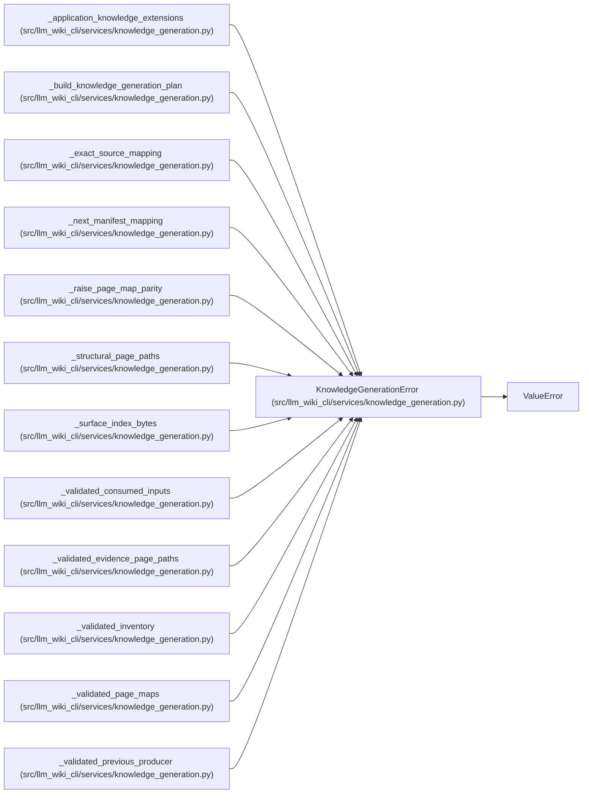

# KnowledgeGenerationError

**Location:** `src/llm_wiki_cli/services/knowledge_generation.py:85`
**Kind:** Class
**Bases:** `ValueError`
**Module:** [knowledge_generation](../modules/knowledge_generation.md)

## Description

Field-specific failure at the shared generation-planning boundary.

## Attributes

*No annotated attributes found.*

## Methods

| Method | Signature | Decorators | Description |
|--------|-----------|------------|-------------|
| `__init__` | `(field: str, message: str)` | — | — |

## Relationships

<!-- Auto-generated relationship summary. Do not edit by hand. -->

### Summary

| Module | Methods | Attributes |
|---|---:|---|
| [knowledge_generation](../modules/knowledge_generation.md) | 1 | — |

### Structure

| Kind | Entity | Module |
|---|---|---|
| Base | `ValueError` | — |

### References

| Reference | Kind | Source | Call sites |
|---|---|---|---:|
| `_application_knowledge_extensions` | call | [knowledge_generation](../modules/knowledge_generation.md) | 2 |
| `_build_knowledge_generation_plan` | call | [knowledge_generation](../modules/knowledge_generation.md) | 4 |
| `_exact_source_mapping` | call | [knowledge_generation](../modules/knowledge_generation.md) | 3 |
| `_next_manifest_mapping` | call | [knowledge_generation](../modules/knowledge_generation.md) | 1 |
| `_raise_page_map_parity` | call | [knowledge_generation](../modules/knowledge_generation.md) | 2 |
| `_structural_page_paths` | call | [knowledge_generation](../modules/knowledge_generation.md) | 2 |
| `_surface_index_bytes` | call | [knowledge_generation](../modules/knowledge_generation.md) | 4 |
| `_validated_consumed_inputs` | call | [knowledge_generation](../modules/knowledge_generation.md) | 5 |
| `_validated_evidence_page_paths` | call | [knowledge_generation](../modules/knowledge_generation.md) | 2 |
| `_validated_inventory` | call | [knowledge_generation](../modules/knowledge_generation.md) | 6 |
| `_validated_page_maps` | call | [knowledge_generation](../modules/knowledge_generation.md) | 6 |
| `_validated_previous_producer` | call | [knowledge_generation](../modules/knowledge_generation.md) | 1 |

> References: showing 12 of 20 logical references; 8 omitted by the 12-row generated summary limit.
