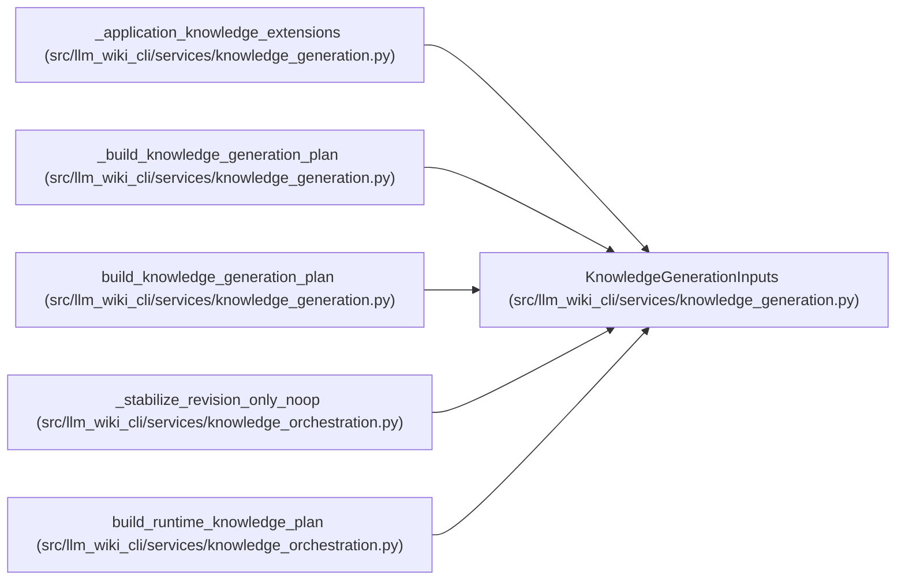

# KnowledgeGenerationInputs

**Location:** `src/llm_wiki_cli/services/knowledge_generation.py:95`
**Kind:** Class
**Bases:** —
**Module:** [knowledge_generation](../modules/knowledge_generation.md)

**Decorators:** `@dataclass(frozen=True)`

## Description

Complete already-evaluated inputs for one generated artifact set.

Exactly one of ``surface_index_bytes`` and ``surface_index_payload`` must
be supplied.  Exact bytes are retained verbatim; a payload is encoded using
the existing surface-index v1 wire format.

``source_content_hashes`` commits each inventory source for manifest and
concept evidence.  ``consumed_inputs`` is the complete source/config input
set used by the envelope and must contain a matching commitment for every
inventory source.

## Attributes

| Name | Type | Default | Description |
|------|------|---------|-------------|
| `wiki_dir` | `str \| Path` | *required* | — |
| `inventory` | `Mapping[str, Mapping[str, Any]]` | *required* | — |
| `pages` | `Sequence[WikiSurfacePage]` | *required* | — |
| `content_by_page` | `Mapping[str, str]` | *required* | — |
| `surface_index_bytes` | `bytes \| None` | *required* | — |
| `surface_index_payload` | `Mapping[str, Any] \| None` | *required* | — |
| `source_content_hashes` | `Mapping[str, str]` | *required* | — |
| `consumed_inputs` | `Sequence[ConsumedInput]` | *required* | — |
| `module_page_map` | `Mapping[str, str]` | *required* | — |
| `entity_occurrence_page_map` | `Mapping[tuple[str, str, int], str]` | *required* | — |
| `extractor_ref_by_source` | `Mapping[str, str]` | *required* | — |
| `inventory_complete_by_source` | `Mapping[str, bool]` | *required* | — |
| `repository_evidence` | `RepositoryEvidence` | *required* | — |
| `generation_options` | `Mapping[str, Any]` | *required* | — |
| `generation_option_defaults` | `Mapping[str, Any]` | *required* | — |
| `generation_option_allowlist` | `Sequence[str]` | *required* | — |
| `tool` | `ProducerComponentInput` | *required* | — |
| `extractors` | `Sequence[ProducerComponentInput]` | `()` | — |
| `plugins` | `Sequence[ProducerComponentInput]` | `()` | — |
| `previous_producer` | `ProducerRecord \| None` | `None` | — |
| `configured_public_identity` | `str \| None` | `None` | — |
| `previous_manifest` | `SyncManifest \| None` | `None` | — |
| `next_manifest` | `SyncManifest \| None` | `None` | — |
| `asset_paths` | `AbstractSet[str]` | `frozenset()` | — |
| `manifest_surfaces` | `Mapping[str, Mapping[str, Any]] \| None` | `None` | — |
| `manifest_generation_inputs` | `Mapping[str, object] \| None` | `None` | — |
| `unknown_evidence_reason` | `str` | `EVIDENCE_NOT_RECORDED` | — |
| `force_unknown_evidence` | `bool` | `False` | — |
| `untrusted_evidence_page_paths` | `AbstractSet[str]` | `frozenset()` | — |
| `regenerated_evidence_page_paths` | `AbstractSet[str]` | `frozenset()` | — |
| `bundle_extensions` | `Mapping[str, Any]` | `field(default_factory=dict)` | — |
| `snapshot_extensions` | `Mapping[str, Any]` | `field(default_factory=dict)` | — |
| `producer_extensions` | `Mapping[str, Any]` | `field(default_factory=dict)` | — |
| `knowledge_extensions` | `Mapping[str, Any]` | `field(default_factory=dict)` | — |
| `call_edges` | `Mapping[str, Any] \| Sequence[Mapping[str, Any]]` | `()` | — |
| `dependency_observations` | `Mapping[str, Any] \| Sequence[Mapping[str, Any]]` | `()` | — |
| `entrypoint_observations` | `Mapping[str, Any] \| Sequence[Mapping[str, Any]]` | `()` | — |
| `flows` | `Sequence[Mapping[str, Any]]` | `()` | — |
| `data_flows` | `Sequence[Mapping[str, Any]]` | `()` | — |
| `external_dependencies` | `Sequence[Mapping[str, Any]]` | `()` | — |
| `graph_analyzer_limitations` | `Mapping[str, Sequence[str]]` | `field(default_factory=dict)` | — |
| `graph_evidence_limit` | `int` | `DEFAULT_EVIDENCE_LIMIT` | — |
| `governance` | `GovernanceLedger \| None` | `None` | — |

## Methods

*No public methods. Inherits from base classes.*

## Relationships

<!-- Auto-generated relationship summary. Do not edit by hand. -->

### Summary

| Module | Methods | Attributes |
|---|---:|---|
| [knowledge_generation](../modules/knowledge_generation.md) | 0 | `asset_paths`, `bundle_extensions`, `call_edges`, `configured_public_identity`, `consumed_inputs`, `content_by_page`, `data_flows`, `dependency_observations`, `entity_occurrence_page_map`, `entrypoint_observations`, `external_dependencies`, `extractor_ref_by_source` |

### References

| Reference | Kind | Source |
|---|---|---|
| `_application_knowledge_extensions` | type_reference | [knowledge_generation](../modules/knowledge_generation.md) |
| `_build_knowledge_generation_plan` | type_reference | [knowledge_generation](../modules/knowledge_generation.md) |
| `build_knowledge_generation_plan` | type_reference | [knowledge_generation](../modules/knowledge_generation.md) |
| `_stabilize_revision_only_noop` | type_reference | [knowledge_orchestration](../modules/knowledge_orchestration.md) |
| `build_runtime_knowledge_plan` | call | [knowledge_orchestration](../modules/knowledge_orchestration.md) |
