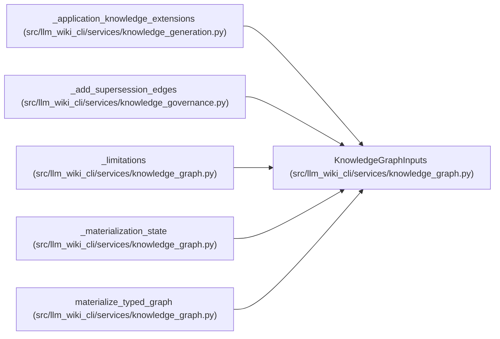

# KnowledgeGraphInputs

**Location:** `src/llm_wiki_cli/services/knowledge_graph.py:131`
**Kind:** Class
**Bases:** —
**Module:** [knowledge_graph](../modules/knowledge_graph.md)

**Decorators:** `@dataclass(frozen=True)`

## Description

Complete evaluated inputs for one pure graph materialization.

## Attributes

| Name | Type | Default | Description |
|------|------|---------|-------------|
| `inventory` | `Mapping[str, Any]` | *required* | — |
| `concepts` | `Sequence[GraphConcept]` | *required* | — |
| `call_edges` | `Mapping[str, Any] \| Sequence[Mapping[str, Any]]` | `()` | — |
| `dependency_observations` | `Mapping[str, Any] \| Sequence[Mapping[str, Any]]` | `()` | — |
| `entrypoint_observations` | `Mapping[str, Any] \| Sequence[Mapping[str, Any]]` | `()` | — |
| `flows` | `Sequence[Mapping[str, Any]]` | `()` | — |
| `data_flows` | `Sequence[Mapping[str, Any]]` | `()` | — |
| `external_dependencies` | `Sequence[Mapping[str, Any]]` | `()` | — |
| `analyzer_limitations` | `Mapping[str, Sequence[str]]` | `field(default_factory=dict)` | — |
| `evidence_limit` | `int` | `DEFAULT_EVIDENCE_LIMIT` | — |

## Methods

*No public methods. Inherits from base classes.*

## Relationships

<!-- Auto-generated relationship summary. Do not edit by hand. -->

### Summary

| Module | Methods | Attributes |
|---|---:|---|
| [knowledge_graph](../modules/knowledge_graph.md) | 0 | `analyzer_limitations`, `call_edges`, `concepts`, `data_flows`, `dependency_observations`, `entrypoint_observations`, `evidence_limit`, `external_dependencies`, `flows`, `inventory` |

### References

| Reference | Kind | Source |
|---|---|---|
| `_application_knowledge_extensions` | call | [knowledge_generation](../modules/knowledge_generation.md) |
| `_add_supersession_edges` | call | [knowledge_governance](../modules/knowledge_governance.md) |
| `_limitations` | type_reference | [knowledge_graph](../modules/knowledge_graph.md) |
| `_materialization_state` | type_reference | [knowledge_graph](../modules/knowledge_graph.md) |
| `materialize_typed_graph` | type_reference | [knowledge_graph](../modules/knowledge_graph.md) |
