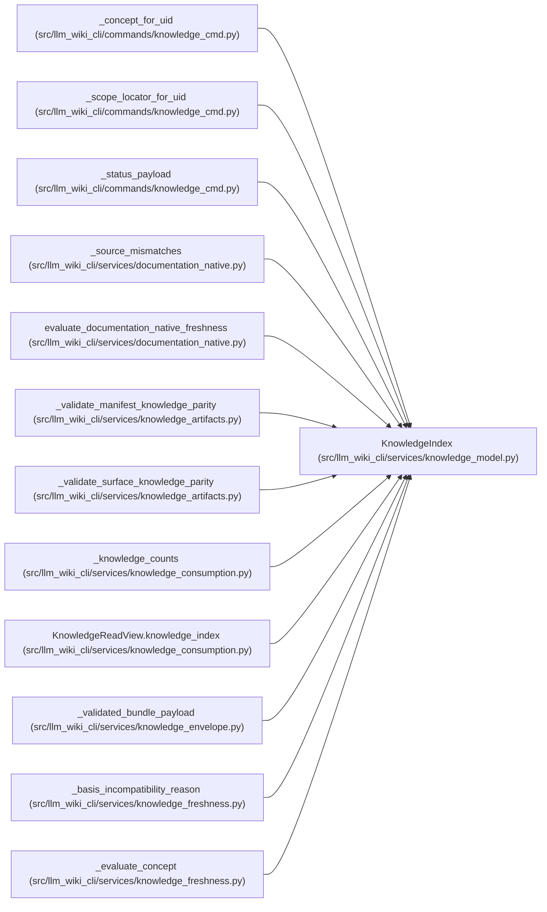

# KnowledgeIndex

**Location:** `src/llm_wiki_cli/services/knowledge_model.py:450`
**Kind:** Class
**Bases:** —
**Module:** [knowledge_model](../modules/knowledge_model.md)

**Decorators:** `@dataclass(frozen=True)`

## Description

_Auto-generated from `KnowledgeIndex` in `src/llm_wiki_cli/services/knowledge_model.py`._

## Attributes

| Name | Type | Default | Description |
|------|------|---------|-------------|
| `schema_version` | `str` | *required* | — |
| `bundle` | `BundleRecord` | *required* | — |
| `concepts` | `tuple[ConceptRecord, ...]` | *required* | — |
| `relationships` | `tuple[RelationshipRecord, ...]` | *required* | — |
| `extensions` | `Extensions` | `field(default_factory=dict)` | — |

## Methods

| Method | Signature | Decorators | Description |
|--------|-----------|------------|-------------|
| `from_payload` | `(payload: object) -> 'KnowledgeIndex'` | `@classmethod` | — |
| `to_payload` | `() -> dict[str, Any]` | — | — |
| `to_json` | `() -> str` | — | — |

## Relationships

<!-- Auto-generated relationship summary. Do not edit by hand. -->

### Summary

| Module | Methods | Attributes |
|---|---:|---|
| [knowledge_model](../modules/knowledge_model.md) | 3 | `bundle`, `concepts`, `extensions`, `relationships`, `schema_version` |

### References

| Reference | Kind | Source | Call sites |
|---|---|---|---:|
| `_concept_for_uid` | type_reference | [knowledge_cmd](../modules/knowledge_cmd.md) | — |
| `_scope_locator_for_uid` | type_reference | [knowledge_cmd](../modules/knowledge_cmd.md) | — |
| `_status_payload` | type_reference | [knowledge_cmd](../modules/knowledge_cmd.md) | — |
| `_source_mismatches` | type_reference | [documentation_native](../modules/documentation_native.md) | — |
| `evaluate_documentation_native_freshness` | type_reference | [documentation_native](../modules/documentation_native.md) | — |
| `_validate_manifest_knowledge_parity` | type_reference | [knowledge_artifacts](../modules/knowledge_artifacts.md) | — |
| `_validate_surface_knowledge_parity` | type_reference | [knowledge_artifacts](../modules/knowledge_artifacts.md) | — |
| `_knowledge_counts` | type_reference | [knowledge_consumption](../modules/knowledge_consumption.md) | — |
| `KnowledgeReadView.knowledge_index` | type_reference | [knowledge_consumption](../modules/knowledge_consumption.md) | — |
| `_validated_bundle_payload` | call | [knowledge_envelope](../modules/knowledge_envelope.md) | 1 |
| `_basis_incompatibility_reason` | type_reference | [knowledge_freshness](../modules/knowledge_freshness.md) | — |
| `_evaluate_concept` | type_reference | [knowledge_freshness](../modules/knowledge_freshness.md) | — |

> References: showing 12 of 52 logical references; 40 omitted by the 12-row generated summary limit.
