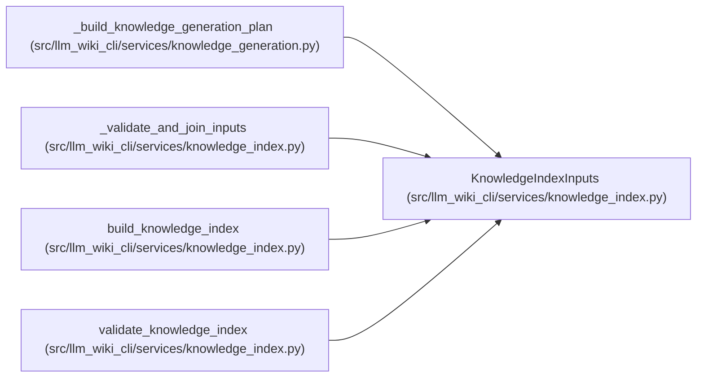

# KnowledgeIndexInputs

**Location:** `src/llm_wiki_cli/services/knowledge_index.py:144`
**Kind:** Class
**Bases:** —
**Module:** [knowledge_index](../modules/knowledge_index.md)

**Decorators:** `@dataclass(frozen=True)`

## Description

Already evaluated values required to construct one knowledge index.

## Attributes

| Name | Type | Default | Description |
|------|------|---------|-------------|
| `envelope` | `EvaluatedEnvelope` | *required* | — |
| `pages` | `Sequence[WikiSurfacePage]` | *required* | — |
| `content_by_page` | `Mapping[str, str]` | *required* | — |
| `surface_index_bytes` | `bytes` | *required* | — |
| `page_source_mappings` | `Mapping[str, ManifestPageSource]` | *required* | — |
| `evidence_baselines` | `Mapping[str, ManifestEvidenceBaseline]` | *required* | — |
| `tombstones` | `Mapping[str, ManifestTombstone]` | *required* | — |
| `link_observations` | `Sequence[LinkObservation]` | *required* | — |
| `infrastructure_bases` | `Mapping[str, ConceptObservationBasis]` | `field(default_factory=dict)` | — |
| `extensions` | `Mapping[str, Any]` | `field(default_factory=dict)` | — |

## Methods

*No public methods. Inherits from base classes.*

## Relationships

<!-- Auto-generated relationship summary. Do not edit by hand. -->

### Summary

| Module | Methods | Attributes |
|---|---:|---|
| [knowledge_index](../modules/knowledge_index.md) | 0 | `content_by_page`, `envelope`, `evidence_baselines`, `extensions`, `infrastructure_bases`, `link_observations`, `page_source_mappings`, `pages`, `surface_index_bytes`, `tombstones` |

### References

| Reference | Kind | Source |
|---|---|---|
| `_build_knowledge_generation_plan` | call | [knowledge_generation](../modules/knowledge_generation.md) |
| `_validate_and_join_inputs` | type_reference | [knowledge_index](../modules/knowledge_index.md) |
| `build_knowledge_index` | type_reference | [knowledge_index](../modules/knowledge_index.md) |
| `validate_knowledge_index` | type_reference | [knowledge_index](../modules/knowledge_index.md) |
