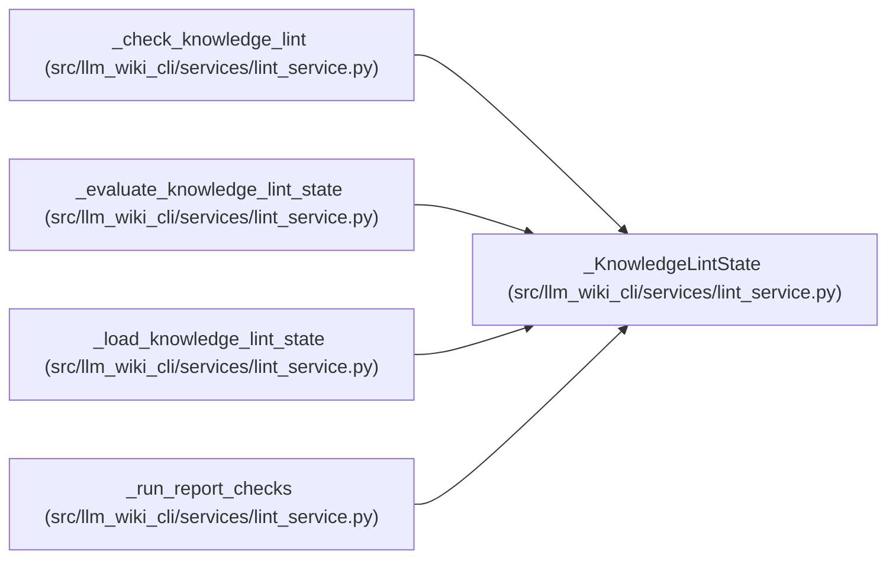

# _KnowledgeLintState

**Location:** `src/llm_wiki_cli/services/lint_service.py:327`
**Kind:** Class
**Bases:** —
**Module:** [lint_service](../modules/lint_service.md)

**Decorators:** `@dataclass(frozen=True)`

## Description

_Auto-generated from `_KnowledgeLintState` in `src/llm_wiki_cli/services/lint_service.py`._

## Attributes

| Name | Type | Default | Description |
|------|------|---------|-------------|
| `enabled` | `bool` | `False` | — |
| `load_result` | `KnowledgeLoadResult \| None` | `None` | — |
| `view` | `KnowledgeReadView \| None` | `None` | — |
| `load_issues` | `tuple[KnowledgeLoadIssue, ...]` | `()` | — |
| `freshness_error_field` | `str \| None` | `None` | — |
| `freshness_error_message` | `str \| None` | `None` | — |

## Methods

*No public methods. Inherits from base classes.*

## Relationships

<!-- Auto-generated relationship summary. Do not edit by hand. -->

### Summary

| Module | Methods | Attributes |
|---|---:|---|
| [lint_service](../modules/lint_service.md) | 0 | `enabled`, `freshness_error_field`, `freshness_error_message`, `load_issues`, `load_result`, `view` |

### References

| Reference | Kind | Source | Call sites |
|---|---|---|---:|
| `_check_knowledge_lint` | type_reference | [lint_service](../modules/lint_service.md) | — |
| `_evaluate_knowledge_lint_state` | call | [lint_service](../modules/lint_service.md) | 3 |
| `_evaluate_knowledge_lint_state` | type_reference | [lint_service](../modules/lint_service.md) | — |
| `_load_knowledge_lint_state` | call | [lint_service](../modules/lint_service.md) | 4 |
| `_load_knowledge_lint_state` | type_reference | [lint_service](../modules/lint_service.md) | — |
| `_run_report_checks` | call | [lint_service](../modules/lint_service.md) | 1 |
