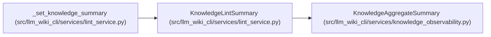

# KnowledgeLintSummary

**Location:** `src/llm_wiki_cli/services/lint_service.py:230`
**Kind:** Class
**Bases:** `KnowledgeAggregateSummary`
**Module:** [lint_service](../modules/lint_service.md)

**Decorators:** `@dataclass(frozen=True)`

## Description

Aggregate strict-lint knowledge status without exposing evidence.

## Attributes

| Name | Type | Default | Description |
|------|------|---------|-------------|
| `concepts_total` | `int` | *required* | — |
| `concepts_by_kind` | `dict[str, int]` | *required* | — |
| `evidence_by_state` | `dict[str, int]` | *required* | — |
| `freshness_by_state` | `dict[str, int]` | *required* | — |

## Methods

| Method | Signature | Decorators | Description |
|--------|-----------|------------|-------------|
| `aggregate_payload` | `() -> dict[str, object]` | — | Return only the shared low-cardinality metrics contract. |
| `report_payload` | `() -> dict[str, object]` | — | Return aggregate observability plus the existing lint-only counts. |

## Relationships

<!-- Auto-generated relationship summary. Do not edit by hand. -->

### Summary

| Module | Methods | Attributes |
|---|---:|---|
| [lint_service](../modules/lint_service.md) | 2 | `concepts_by_kind`, `concepts_total`, `evidence_by_state`, `freshness_by_state` |

### Structure

| Kind | Entity | Module |
|---|---|---|
| Base | `KnowledgeAggregateSummary` | [knowledge_observability](../modules/knowledge_observability.md) |

### References

| Reference | Kind | Source |
|---|---|---|
| `_set_knowledge_summary` | call | [lint_service](../modules/lint_service.md) |
