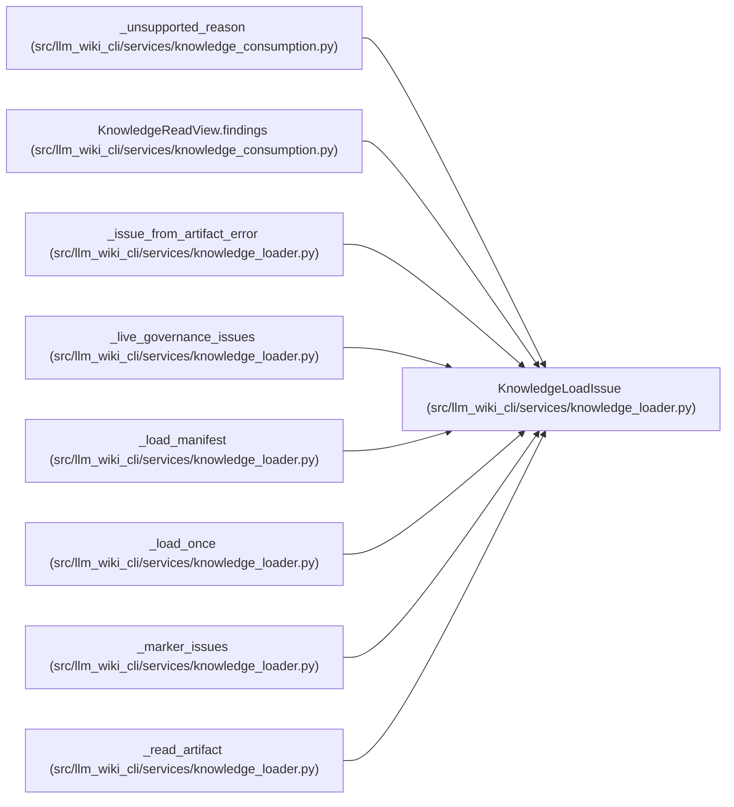

# KnowledgeLoadIssue

**Location:** `src/llm_wiki_cli/services/knowledge_loader.py:45`
**Kind:** Class
**Bases:** —
**Module:** [knowledge_loader](../modules/knowledge_loader.md)

**Decorators:** `@dataclass(frozen=True)`

## Description

One stable, path-safe artifact load diagnostic.

## Attributes

| Name | Type | Default | Description |
|------|------|---------|-------------|
| `code` | `str` | *required* | — |
| `artifact_path` | `str` | *required* | — |
| `message` | `str` | *required* | — |
| `field` | `str \| None` | `None` | — |

## Methods

*No public methods. Inherits from base classes.*

## Relationships

<!-- Auto-generated relationship summary. Do not edit by hand. -->

### Summary

| Module | Methods | Attributes |
|---|---:|---|
| [knowledge_loader](../modules/knowledge_loader.md) | 0 | `artifact_path`, `code`, `field`, `message` |

### References

| Reference | Kind | Source | Call sites |
|---|---|---|---:|
| `_unsupported_reason` | type_reference | [knowledge_consumption](../modules/knowledge_consumption.md) | — |
| `KnowledgeReadView.findings` | type_reference | [knowledge_consumption](../modules/knowledge_consumption.md) | — |
| `_issue_from_artifact_error` | call | [knowledge_loader](../modules/knowledge_loader.md) | 1 |
| `_issue_from_artifact_error` | type_reference | [knowledge_loader](../modules/knowledge_loader.md) | — |
| `_live_governance_issues` | call | [knowledge_loader](../modules/knowledge_loader.md) | 6 |
| `_live_governance_issues` | type_reference | [knowledge_loader](../modules/knowledge_loader.md) | — |
| `_load_manifest` | call | [knowledge_loader](../modules/knowledge_loader.md) | 4 |
| `_load_manifest` | type_reference | [knowledge_loader](../modules/knowledge_loader.md) | — |
| `_load_once` | call | [knowledge_loader](../modules/knowledge_loader.md) | 7 |
| `_marker_issues` | call | [knowledge_loader](../modules/knowledge_loader.md) | 1 |
| `_marker_issues` | type_reference | [knowledge_loader](../modules/knowledge_loader.md) | — |
| `_read_artifact` | call | [knowledge_loader](../modules/knowledge_loader.md) | 4 |

> References: showing 12 of 18 logical references; 6 omitted by the 12-row generated summary limit.
