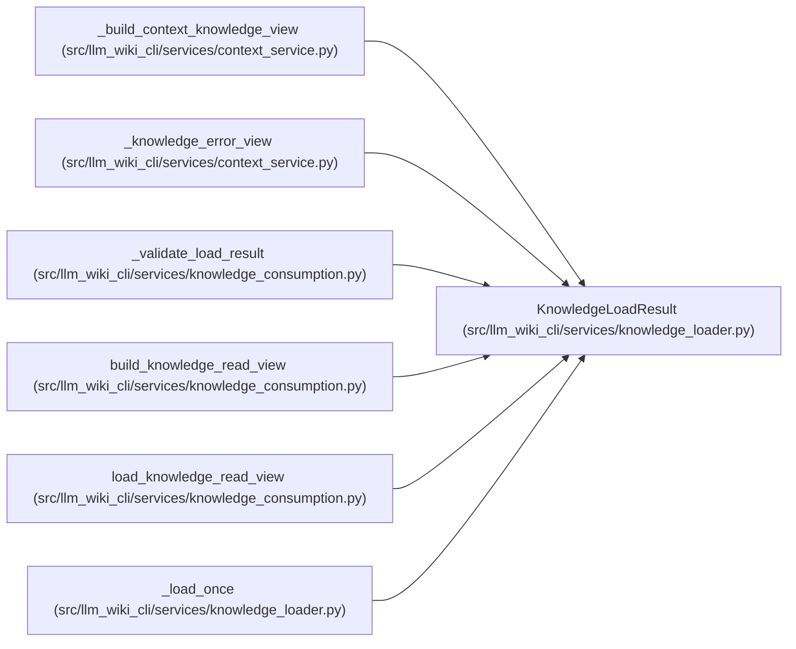

# KnowledgeLoadResult

**Location:** `src/llm_wiki_cli/services/knowledge_loader.py:55`
**Kind:** Class
**Bases:** —
**Module:** [knowledge_loader](../modules/knowledge_loader.md)

**Decorators:** `@dataclass(frozen=True)`

## Description

Validated knowledge state or an explicit compatibility fallback.

## Attributes

| Name | Type | Default | Description |
|------|------|---------|-------------|
| `status` | `KnowledgeLoadState` | *required* | — |
| `surface` | `Mapping[str, Any] \| None` | *required* | — |
| `knowledge` | `KnowledgeIndex \| None` | *required* | — |
| `manifest_basis` | `SyncManifest \| None` | *required* | — |
| `issues` | `tuple[KnowledgeLoadIssue, ...]` | `()` | — |
| `underlying_status` | `KnowledgeLoadState \| None` | `None` | — |
| `rebuilt` | `bool` | `False` | — |

## Methods

*No public methods. Inherits from base classes.*

## Relationships

<!-- Auto-generated relationship summary. Do not edit by hand. -->

### Summary

| Module | Methods | Attributes |
|---|---:|---|
| [knowledge_loader](../modules/knowledge_loader.md) | 0 | `issues`, `knowledge`, `manifest_basis`, `rebuilt`, `status`, `surface`, `underlying_status` |

### References

| Reference | Kind | Source |
|---|---|---|
| `_build_context_knowledge_view` | call | [context_service](../modules/context_service.md) |
| `_knowledge_error_view` | call | [context_service](../modules/context_service.md) |
| `_knowledge_error_view` | call | [context_service](../modules/context_service.md) |
| `_validate_load_result` | type_reference | [knowledge_consumption](../modules/knowledge_consumption.md) |
| `build_knowledge_read_view` | type_reference | [knowledge_consumption](../modules/knowledge_consumption.md) |
| `load_knowledge_read_view` | call | [knowledge_consumption](../modules/knowledge_consumption.md) |
| `_load_once` | call | [knowledge_loader](../modules/knowledge_loader.md) |
| `_load_once` | call | [knowledge_loader](../modules/knowledge_loader.md) |
| `_load_once` | call | [knowledge_loader](../modules/knowledge_loader.md) |
| `_load_once` | call | [knowledge_loader](../modules/knowledge_loader.md) |
| `_load_once` | call | [knowledge_loader](../modules/knowledge_loader.md) |
| `_load_once` | call | [knowledge_loader](../modules/knowledge_loader.md) |
