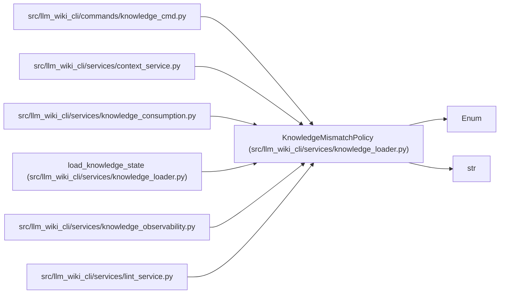

# KnowledgeMismatchPolicy

**Location:** `src/llm_wiki_cli/services/knowledge_loader.py:36`
**Kind:** Enum
**Bases:** `str`, `Enum`
**Module:** [knowledge_loader](../modules/knowledge_loader.md)

## Description

Caller-selected behavior when a present artifact set is not valid.

## Attributes

| Name | Declared value | Description |
|------|-------|-------------|
| `REJECT` | `'reject'` | — |
| `REBUILD` | `'rebuild'` | — |
| `DEGRADED` | `'degraded'` | — |

## Methods

*No public methods. Inherits from base classes.*

## Relationships

<!-- Auto-generated relationship summary. Do not edit by hand. -->

### Summary

| Module | Methods | Attributes |
|---|---:|---|
| [knowledge_loader](../modules/knowledge_loader.md) | 0 | `DEGRADED`, `REBUILD`, `REJECT` |

### Structure

| Kind | Entity | Module |
|---|---|---|
| Base | `Enum` | — |
| Base | `str` | — |

### References

| Reference | Kind | Source | Call sites |
|---|---|---|---:|
| `knowledge_cmd` | import | [knowledge_cmd](../modules/knowledge_cmd.md) | — |
| `context_service` | import | [context_service](../modules/context_service.md) | — |
| `knowledge_consumption` | import | [knowledge_consumption](../modules/knowledge_consumption.md) | — |
| `load_knowledge_state` | call | [knowledge_loader](../modules/knowledge_loader.md) | 1 |
| `load_knowledge_state` | type_reference | [knowledge_loader](../modules/knowledge_loader.md) | — |
| `knowledge_observability` | import | [knowledge_observability](../modules/knowledge_observability.md) | — |
| `lint_service` | import | [lint_service](../modules/lint_service.md) | — |
