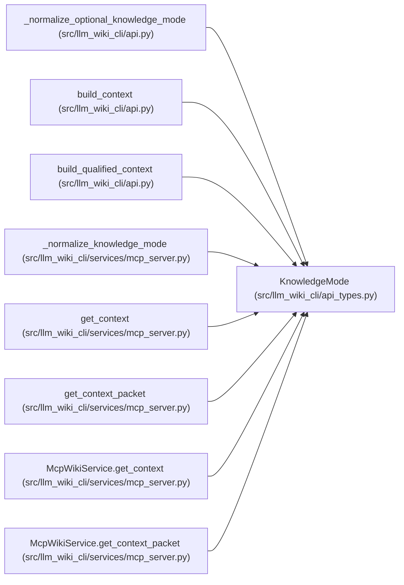

# KnowledgeMode

**Location:** `src/llm_wiki_cli/api_types.py:14`
**Kind:** Type alias
**Bases:** —
**Module:** [api_types](../modules/api_types.md)
**Target:** `Literal['off', 'auto', 'required']`

## Description

_Auto-generated from `KnowledgeMode` in `src/llm_wiki_cli/api_types.py`._

## Attributes

*No annotated attributes found.*

## Methods

*No public methods. Inherits from base classes.*

## Relationships

<!-- Auto-generated relationship summary. Do not edit by hand. -->

### Summary

| Module | Methods | Attributes |
|---|---:|---|
| [api_types](../modules/api_types.md) | 0 | — |

### References

| Reference | Kind | Source | Call sites |
|---|---|---|---:|
| `_normalize_optional_knowledge_mode` | type_reference | [api](../modules/api.md) | — |
| `build_context` | type_reference | [api](../modules/api.md) | — |
| `build_qualified_context` | type_reference | [api](../modules/api.md) | — |
| `_normalize_knowledge_mode` | type_reference | [mcp_server](../modules/mcp_server.md) | — |
| `get_context` | type_reference | [mcp_server](../modules/mcp_server.md) | — |
| `get_context_packet` | type_reference | [mcp_server](../modules/mcp_server.md) | — |
| `McpWikiService.get_context` | type_reference | [mcp_server](../modules/mcp_server.md) | — |
| `McpWikiService.get_context_packet` | type_reference | [mcp_server](../modules/mcp_server.md) | — |
