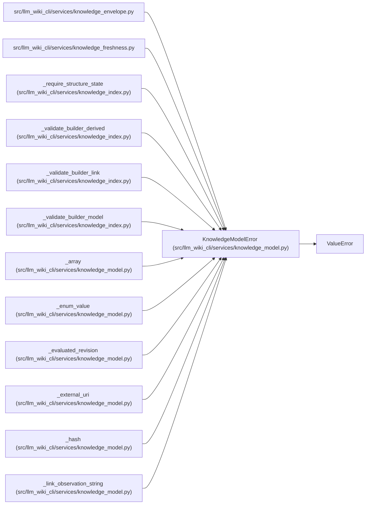

# KnowledgeModelError

**Location:** `src/llm_wiki_cli/services/knowledge_model.py:77`
**Kind:** Class
**Bases:** `ValueError`
**Module:** [knowledge_model](../modules/knowledge_model.md)

## Description

Raised when a knowledge payload violates the v1 contract.

## Attributes

*No annotated attributes found.*

## Methods

| Method | Signature | Decorators | Description |
|--------|-----------|------------|-------------|
| `__init__` | `(field: str, message: str, *, code: str \| None = None)` | — | — |

## Relationships

<!-- Auto-generated relationship summary. Do not edit by hand. -->

### Summary

| Module | Methods | Attributes |
|---|---:|---|
| [knowledge_model](../modules/knowledge_model.md) | 1 | — |

### Structure

| Kind | Entity | Module |
|---|---|---|
| Base | `ValueError` | — |

### References

| Reference | Kind | Source | Call sites |
|---|---|---|---:|
| `knowledge_envelope` | import | [knowledge_envelope](../modules/knowledge_envelope.md) | — |
| `knowledge_freshness` | import | [knowledge_freshness](../modules/knowledge_freshness.md) | — |
| `_require_structure_state` | call | [knowledge_index](../modules/knowledge_index.md) | 3 |
| `_validate_builder_derived` | call | [knowledge_index](../modules/knowledge_index.md) | 9 |
| `_validate_builder_link` | call | [knowledge_index](../modules/knowledge_index.md) | 17 |
| `_validate_builder_model` | call | [knowledge_index](../modules/knowledge_index.md) | 11 |
| `_array` | call | [knowledge_model](../modules/knowledge_model.md) | 1 |
| `_enum_value` | call | [knowledge_model](../modules/knowledge_model.md) | 2 |
| `_evaluated_revision` | call | [knowledge_model](../modules/knowledge_model.md) | 1 |
| `_external_uri` | call | [knowledge_model](../modules/knowledge_model.md) | 6 |
| `_hash` | call | [knowledge_model](../modules/knowledge_model.md) | 1 |
| `_link_observation_string` | call | [knowledge_model](../modules/knowledge_model.md) | 1 |

> References: showing 12 of 43 logical references; 31 omitted by the 12-row generated summary limit.
