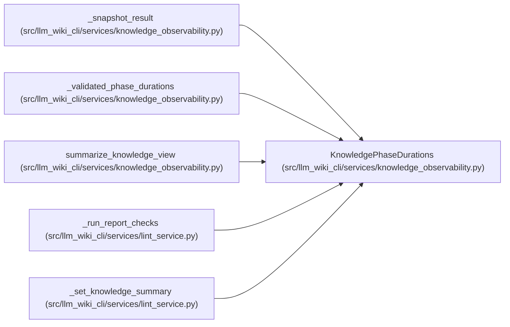

# KnowledgePhaseDurations

**Location:** `src/llm_wiki_cli/services/knowledge_observability.py:194`
**Kind:** Class
**Bases:** —
**Module:** [knowledge_observability](../modules/knowledge_observability.md)

**Decorators:** `@dataclass(frozen=True)`

## Description

Operational phase durations in milliseconds.

``None`` means that a phase was not run.  In particular, snapshot-only
status must not fabricate zero-duration evaluation or check phases.

## Attributes

| Name | Type | Default | Description |
|------|------|---------|-------------|
| `load_ms` | `int \| None` | `None` | — |
| `evaluate_ms` | `int \| None` | `None` | — |
| `check_ms` | `int \| None` | `None` | — |

## Methods

| Method | Signature | Decorators | Description |
|--------|-----------|------------|-------------|
| `__post_init__` | `() -> None` | — | — |
| `to_payload` | `() -> dict[str, int \| None]` | — | — |

## Relationships

<!-- Auto-generated relationship summary. Do not edit by hand. -->

### Summary

| Module | Methods | Attributes |
|---|---:|---|
| [knowledge_observability](../modules/knowledge_observability.md) | 2 | `check_ms`, `evaluate_ms`, `load_ms` |

### References

| Reference | Kind | Source | Call sites |
|---|---|---|---:|
| `_snapshot_result` | call | [knowledge_observability](../modules/knowledge_observability.md) | 1 |
| `_validated_phase_durations` | call | [knowledge_observability](../modules/knowledge_observability.md) | 1 |
| `summarize_knowledge_view` | call | [knowledge_observability](../modules/knowledge_observability.md) | 1 |
| `summarize_knowledge_view` | type_reference | [knowledge_observability](../modules/knowledge_observability.md) | — |
| `_run_report_checks` | call | [lint_service](../modules/lint_service.md) | 1 |
| `_set_knowledge_summary` | type_reference | [lint_service](../modules/lint_service.md) | — |
