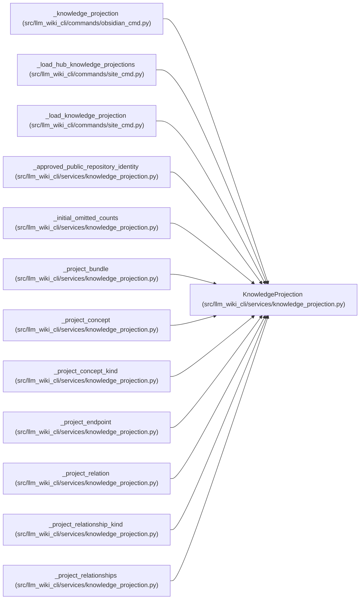

# KnowledgeProjection

**Location:** `src/llm_wiki_cli/services/knowledge_projection.py:207`
**Kind:** Class
**Bases:** —
**Module:** [knowledge_projection](../modules/knowledge_projection.md)

**Decorators:** `@dataclass(frozen=True)`

## Description

One deterministic exporter-facing projection.

## Attributes

| Name | Type | Default | Description |
|------|------|---------|-------------|
| `schema_version` | `str` | *required* | — |
| `profile` | `KnowledgeProjectionProfile` | *required* | — |
| `source_knowledge_hash` | `str` | *required* | — |
| `bundle` | `Mapping[str, Any]` | *required* | — |
| `concepts` | `Mapping[str, Mapping[str, Any]]` | *required* | — |
| `warnings` | `tuple[str, ...]` | *required* | — |
| `omitted_fields` | `Mapping[str, int]` | *required* | — |
| `freshness` | `str \| None` | `None` | — |

## Methods

| Method | Signature | Decorators | Description |
|--------|-----------|------------|-------------|
| `__post_init__` | `() -> None` | — | Detach and recursively freeze every caller-supplied container. |
| `to_payload` | `() -> dict[str, Any]` | — | Return a detached JSON-compatible payload. |
| `concept_for_path` | `(canonical_path: str) -> Mapping[str, Any] \| None` | — | Return one projected concept by exact canonical Markdown path. |

## Relationships

<!-- Auto-generated relationship summary. Do not edit by hand. -->

### Summary

| Module | Methods | Attributes |
|---|---:|---|
| [knowledge_projection](../modules/knowledge_projection.md) | 3 | `bundle`, `concepts`, `freshness`, `omitted_fields`, `profile`, `schema_version`, `source_knowledge_hash`, `warnings` |

### References

| Reference | Kind | Source | Call sites |
|---|---|---|---:|
| `_knowledge_projection` | type_reference | [obsidian_cmd](../modules/obsidian_cmd.md) | — |
| `_load_hub_knowledge_projections` | type_reference | [site_cmd](../modules/site_cmd.md) | — |
| `_load_knowledge_projection` | type_reference | [site_cmd](../modules/site_cmd.md) | — |
| `_approved_public_repository_identity` | type_reference | [knowledge_projection](../modules/knowledge_projection.md) | — |
| `_initial_omitted_counts` | type_reference | [knowledge_projection](../modules/knowledge_projection.md) | — |
| `_project_bundle` | type_reference | [knowledge_projection](../modules/knowledge_projection.md) | — |
| `_project_concept` | type_reference | [knowledge_projection](../modules/knowledge_projection.md) | — |
| `_project_concept_kind` | type_reference | [knowledge_projection](../modules/knowledge_projection.md) | — |
| `_project_endpoint` | type_reference | [knowledge_projection](../modules/knowledge_projection.md) | — |
| `_project_relation` | type_reference | [knowledge_projection](../modules/knowledge_projection.md) | — |
| `_project_relationship_kind` | type_reference | [knowledge_projection](../modules/knowledge_projection.md) | — |
| `_project_relationships` | type_reference | [knowledge_projection](../modules/knowledge_projection.md) | — |

> References: showing 12 of 49 logical references; 37 omitted by the 12-row generated summary limit.
