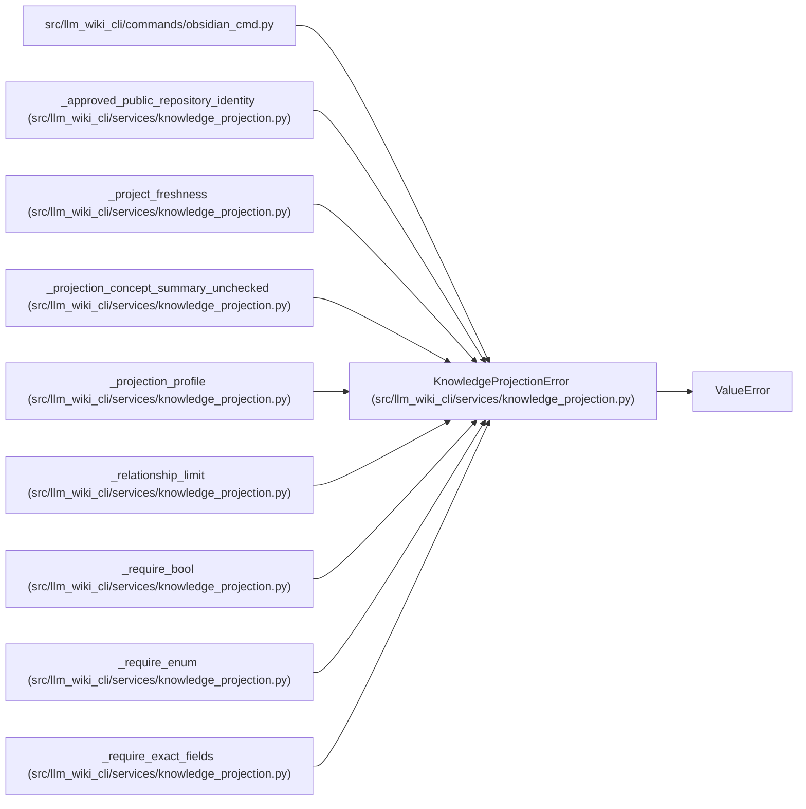

# KnowledgeProjectionError

**Location:** `src/llm_wiki_cli/services/knowledge_projection.py:196`
**Kind:** Class
**Bases:** `ValueError`
**Module:** [knowledge_projection](../modules/knowledge_projection.md)

## Description

Stable failure at the validated projection boundary.

## Attributes

*No annotated attributes found.*

## Methods

| Method | Signature | Decorators | Description |
|--------|-----------|------------|-------------|
| `__init__` | `(code: str, field: str, message: str)` | — | — |

## Relationships

<!-- Auto-generated relationship summary. Do not edit by hand. -->

### Summary

| Module | Methods | Attributes |
|---|---:|---|
| [knowledge_projection](../modules/knowledge_projection.md) | 1 | — |

### Structure

| Kind | Entity | Module |
|---|---|---|
| Base | `ValueError` | — |

### References

| Reference | Kind | Source |
|---|---|---|
| `obsidian_cmd` | import | [obsidian_cmd](../modules/obsidian_cmd.md) |
| `_approved_public_repository_identity` | call | [knowledge_projection](../modules/knowledge_projection.md) |
| `_approved_public_repository_identity` | call | [knowledge_projection](../modules/knowledge_projection.md) |
| `_approved_public_repository_identity` | call | [knowledge_projection](../modules/knowledge_projection.md) |
| `_project_freshness` | call | [knowledge_projection](../modules/knowledge_projection.md) |
| `_project_freshness` | call | [knowledge_projection](../modules/knowledge_projection.md) |
| `_projection_concept_summary_unchecked` | call | [knowledge_projection](../modules/knowledge_projection.md) |
| `_projection_profile` | call | [knowledge_projection](../modules/knowledge_projection.md) |
| `_relationship_limit` | call | [knowledge_projection](../modules/knowledge_projection.md) |
| `_require_bool` | call | [knowledge_projection](../modules/knowledge_projection.md) |
| `_require_enum` | call | [knowledge_projection](../modules/knowledge_projection.md) |
| `_require_exact_fields` | call | [knowledge_projection](../modules/knowledge_projection.md) |
