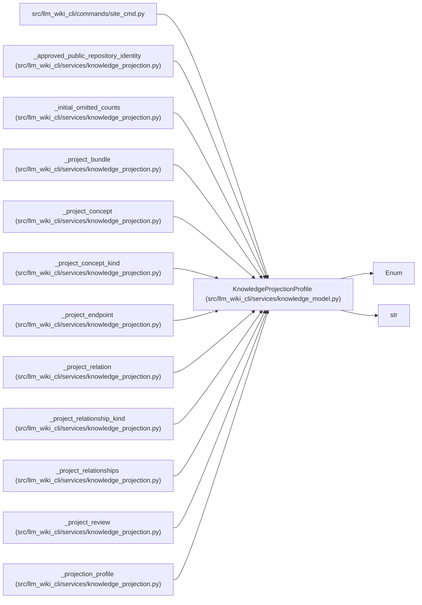

# KnowledgeProjectionProfile

**Location:** `src/llm_wiki_cli/services/knowledge_model.py:191`
**Kind:** Enum
**Bases:** `str`, `Enum`
**Module:** [knowledge_model](../modules/knowledge_model.md)

## Description

Out-of-band projection policies; never selected by artifact metadata.

## Attributes

| Name | Declared value | Description |
|------|-------|-------------|
| `INTERNAL` | `'internal'` | — |
| `PUBLIC_PORTABLE` | `'public-portable'` | — |

## Methods

*No public methods. Inherits from base classes.*

## Relationships

<!-- Auto-generated relationship summary. Do not edit by hand. -->

### Summary

| Module | Methods | Attributes |
|---|---:|---|
| [knowledge_model](../modules/knowledge_model.md) | 0 | `INTERNAL`, `PUBLIC_PORTABLE` |

### Structure

| Kind | Entity | Module |
|---|---|---|
| Base | `Enum` | — |
| Base | `str` | — |

### References

| Reference | Kind | Source | Call sites |
|---|---|---|---:|
| `site_cmd` | import | [site_cmd](../modules/site_cmd.md) | — |
| `_approved_public_repository_identity` | type_reference | [knowledge_projection](../modules/knowledge_projection.md) | — |
| `_initial_omitted_counts` | type_reference | [knowledge_projection](../modules/knowledge_projection.md) | — |
| `_project_bundle` | type_reference | [knowledge_projection](../modules/knowledge_projection.md) | — |
| `_project_concept` | type_reference | [knowledge_projection](../modules/knowledge_projection.md) | — |
| `_project_concept_kind` | type_reference | [knowledge_projection](../modules/knowledge_projection.md) | — |
| `_project_endpoint` | type_reference | [knowledge_projection](../modules/knowledge_projection.md) | — |
| `_project_relation` | type_reference | [knowledge_projection](../modules/knowledge_projection.md) | — |
| `_project_relationship_kind` | type_reference | [knowledge_projection](../modules/knowledge_projection.md) | — |
| `_project_relationships` | type_reference | [knowledge_projection](../modules/knowledge_projection.md) | — |
| `_project_review` | type_reference | [knowledge_projection](../modules/knowledge_projection.md) | — |
| `_projection_profile` | call | [knowledge_projection](../modules/knowledge_projection.md) | 1 |

> References: showing 12 of 23 logical references; 11 omitted by the 12-row generated summary limit.
