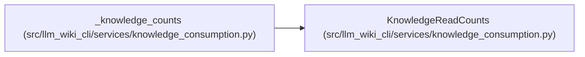

# KnowledgeReadCounts

**Location:** `src/llm_wiki_cli/services/knowledge_consumption.py:266`
**Kind:** Class
**Bases:** —
**Module:** [knowledge_consumption](../modules/knowledge_consumption.md)

**Decorators:** `@dataclass(frozen=True)`

## Description

Aggregate counts derived only from a ready knowledge projection.

Evidence counts cover the structural evidence state of each concept.
Every closed evidence and freshness enum state is present, including states
whose count is zero.  ``freshness_by_state`` is ``None`` in snapshot-only
mode rather than a fabricated set of zero freshness claims.

## Attributes

| Name | Type | Default | Description |
|------|------|---------|-------------|
| `concepts_total` | `int` | *required* | — |
| `concepts_by_kind` | `Mapping[str, int]` | *required* | — |
| `evidence_by_state` | `Mapping[EvidenceState, int]` | *required* | — |
| `freshness_by_state` | `Mapping[ComputedFreshness, int] \| None` | *required* | — |

## Methods

| Method | Signature | Decorators | Description |
|--------|-----------|------------|-------------|
| `concept_total` | `() -> int` | `@property` | Compatibility spelling for consumers using a singular noun. |

## Relationships

<!-- Auto-generated relationship summary. Do not edit by hand. -->

### Summary

| Module | Methods | Attributes |
|---|---:|---|
| [knowledge_consumption](../modules/knowledge_consumption.md) | 1 | `concepts_by_kind`, `concepts_total`, `evidence_by_state`, `freshness_by_state` |

### References

| Reference | Kind | Source | Call sites |
|---|---|---|---:|
| `_knowledge_counts` | call | [knowledge_consumption](../modules/knowledge_consumption.md) | 1 |
| `_knowledge_counts` | type_reference | [knowledge_consumption](../modules/knowledge_consumption.md) | — |
